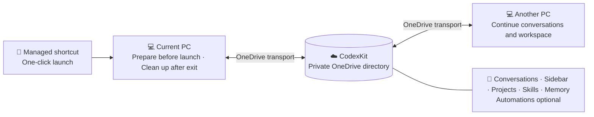

# Codex SyncKit

[简体中文](README.zh-CN.md) | English

**Install once, launch with one click, and carry a complete Codex working
environment to every Windows PC.**

Codex SyncKit connects PCs through OneDrive without manual junctions or copying
hidden folders by hand, providing a continuous Codex experience across
machines:

- **🚀 One-click launch:** After setup, simply open the managed `ChatGPT`
  Start-menu shortcut. It prepares synchronization before launch and performs
  cleanup after ChatGPT closes.
- **🔄 Comprehensive continuity:** Conversations, sidebar and project
  organization, project workspaces, skills, hooks, global guidance, long-term
  memory, and environment inventories can stay continuous. Automations remain
  optional.
- **🧰 Your capabilities travel too:** Reusable Codex skills are synchronized,
  including skills for creating flowcharts, architecture diagrams, and other
  illustrations, so a new PC does not require rebuilding the whole workflow.
- **🧠 Local Memory Observatory:** The bundled
  [`dashboard`](dashboard/README.md) audits registered project memories,
  sidebar coverage, global namespaces, maintenance health, and controlled
  discovery without uploading private memory to an external service.

## Installation and use

Requirements: Windows 10 or 11, Windows PowerShell 5.1 or newer, OneDrive,
Codex/ChatGPT desktop or Codex CLI, and Node.js for the desktop-state helpers.
The optional memory subsystem's Bash maintenance tools require Git for Windows
or another compatible Bash runtime.

1. Download and extract
   [`codex-synckit-0.1.0-alpha.zip`](https://github.com/wang22ti/codex-synckit/releases/download/v0.1.0-alpha/codex-synckit-0.1.0-alpha.zip).
   See the [release notes](https://github.com/wang22ti/codex-synckit/releases/tag/v0.1.0-alpha)
   for Alpha limitations and verification details.
2. Double-click `Install-CodexSyncKit.cmd` to start setup.

The default setup includes complete conversations and sidebar organization.
Keep the generated OneDrive `CodexKit` directory private; do not commit it to a
public repository or expose it through a public sharing link.

The installer then asks whether to add the long-term memory subsystem. There is
no default answer: enter `Y` or `N`. For unattended installation, make the same
choice explicitly with `-InstallMemorySubsystem` or `-SkipMemorySubsystem`.
Choosing not to add it does not delete a previously installed copy or existing
private memory.

The installer automatically distinguishes between **initializing a new Kit**
and **joining an existing Kit**:

- On the first PC, a new empty destination is initialized from the selected
  local data.
- On later PCs, an existing `CodexKit` is joined without exporting local
  conversations, sidebar state, skills, or memory over the OneDrive copy.
- A nonempty directory that is not recognized as a CodexKit is rejected rather
  than guessed at or overwritten.

It then adds the bundled `codexkit-sync` skill, applies the recommended links,
and creates the managed `ChatGPT` shortcut. Conversation and desktop-state
synchronization are enabled by default; use `-ExcludeSessions` or
`-ExcludeDesktopState` only when those categories should remain local.

Setup is performed once. Afterward, click the managed `ChatGPT` Start-menu
shortcut for one-click launch; synchronization preparation and shutdown cleanup
run automatically.

## How it works

1. For a new empty destination, the installer creates a private `CodexKit` from
   the selected data on the current PC. For an existing Kit, it joins without
   exporting stale local data back into the shared copy.
2. It connects each Windows PC with verified links, controlled file copying,
   hooks, and a managed Start-menu shortcut.
3. During installation, it requires an explicit Yes or No choice for the
   optional long-term memory subsystem; pressing Enter alone selects nothing.
4. OneDrive transports file changes. Codex SyncKit supplies the Codex-specific
   layout, validation, backup, conflict protection, and startup/shutdown
   coordination.

Local data is backed up before a local directory is replaced. An existing
OneDrive Kit is not reinitialized while another PC joins it. Unrecognized,
unsupported, or conflicting state fails closed.

## What it synchronizes

Codex SyncKit is designed around Codex's data layout rather than treating the
whole application directory as an ordinary folder. It synchronizes portable
state, keeps device-local state out of the shared package, and stops before
mutation when it detects an unsafe conflict.

In the paths below, `%USERPROFILE%` is the current Windows user folder and
`CodexKit\...` is inside the private OneDrive package.

| Category | Default | Local source → shared location | What this means |
| --- | --- | --- | --- |
| Skills | On | `.codex\skills` → `CodexKit\skills` | Reusable instructions and tools that teach Codex how to perform specialized tasks |
| Hooks | On | `.codex\hooks.json` and its scripts → `CodexKit\hooks` | Commands triggered at events such as session start or prompt submission; hook trust remains local to each PC |
| Global instructions | On | `.codex\AGENTS.md` → `CodexKit\rules\global` | Instructions Codex should follow across all projects; these are not command-approval rules |
| Long-term memory subsystem | Asked during installation | Subsystem code is installed as a Codex skill; private memory uses project `.learnings` folders and `%USERPROFILE%\global-memory` | Captures, recalls, organizes, and maintains facts and lessons across conversations and projects |
| Conversation history | On | `.codex\sessions`, `.codex\archived_sessions`, `.codex\session_index.jsonl` → `CodexKit\session-data` | Complete active and archived conversations plus their title index, so another PC can reopen them |
| Sidebar and project organization | On | Portable fields from `.codex\.codex-global-state.json` → `CodexKit\desktop-state` | Task titles, project groups, task-to-project assignments, descriptions, pins, and ordering; **not the actual project files** |
| Project workspace files | On | `Documents\Codex` ⇄ `CodexKit\CodexProjects` | Pulled before managed launch and pushed after exit; the local path remains a real directory as Codex requires, while source, documents, `.git`, `.agents`, and project-level `.codex` settings synchronize |
| Codex automations | Optional | `.codex\automations` → `CodexKit\automations` | Automation definitions such as `automation.toml` and their `memory.md`; only one designated PC should execute a shared schedule |
| Device environment inventory | On | Current PC scan → `CodexKit\environment\devices\<computer>.json` | A report of installed tools and versions for comparing PCs; it does not install or copy applications |
| Plugin inventory | On | Names and versions found under `.codex\plugins\cache` → `CodexKit\plugins\inventory.json` | A list used to report missing plugins on another PC; plugin programs and caches are not copied |
| Sanitized configuration snapshot | Recorded, not applied | `.codex\config.toml` and `*.config.toml` → `CodexKit\profiles` | A reference copy with likely secrets redacted; model choice, reasoning level, features, trust, and other live preferences remain selected locally |
| Credentials and device-only runtime state | Never | Not copied to OneDrive | `auth.json`, `.codex\rules`, `state_5.sqlite`, Codex logs, caches, sandbox data, trust hashes, SSH keys, `.env` files, and likely secret/token files remain local |

**Additional notes**

- **Long-term memory**
  - It is managed by the bundled [`memory-and-improvement`](subsystems/memory-and-improvement/README.md) subsystem, not merely copied as a folder.
  - Project memory is stored in `.learnings`; cross-project memory is stored in `global-memory`.
  - `.learnings` inside the default projectless workspace follows workspace synchronization; projects elsewhere still need their own OneDrive placement.
- **Sidebar and project workspaces**
  - “Sidebar and project organization” synchronizes how projects and tasks appear and are organized in ChatGPT.
  - “Project workspace files” synchronizes the real folders and files stored on disk.
  - Default workspace paths are stored portably in shared state and localized to the current PC during Pull.
- **Privacy**
  - Conversation history, memory, sidebar organization, environment reports, and configuration snapshots may contain prompts, responses, learned facts, project names, software details, and local paths.
  - Keep the generated `CodexKit` directory private and see [Privacy](docs/PRIVACY.md) for the data boundary.

## Compared with synchronization tools

The comparison below covers tools that synchronize agent configuration,
context, or working state. It does not compare the agents themselves.

| Tool | Primary synchronization target | Cross-device transport | Scope boundary |
| --- | --- | --- | --- |
| **Codex SyncKit** | Codex conversations, sidebar organization, skills, hooks, global guidance, memory, projects, automations, and environment inventory | Private OneDrive directory | Designed for complete Codex continuity on Windows while separating shared and device-local state |
| [coding-agent-sync](https://marketplace.visualstudio.com/items?itemName=TCTinh.coding-agent-sync) | Claude Code and OpenCode settings, MCP, commands, agents, skills, and context bundles | Encrypted private GitHub Gist with explicit `push` / `pull` | OpenCode supports portable context export/import; Codex support is still listed as coming soon |
| [agentsync](https://agentsync.cc/) | Translates canonical MCP, memory, skills, subagents, commands, hooks, and plugin components into native formats for multiple coding agents | Its canonical directory can be carried through dotfiles or Git and applied on each machine | Focuses on cross-agent configuration translation and drift handling, not conversation history or desktop sidebar state |
| [skillshare](https://github.com/runkids/skillshare) | Skills, agents, rules, commands, and other file-based resources for many AI CLIs | A Git remote can carry the canonical resource repository between machines | Broad agent coverage and security auditing, but no conversation, desktop-state, or application-runtime synchronization |
| [agent-rules-sync](https://github.com/dhruv-anand-aintech/agent-rules-sync) | Rules and skills across Claude, Cursor, Gemini, OpenCode, Codex, and others, plus Claude settings and hooks | A local daemon synchronizes agent directories and selected repositories; a repository or another transport is still needed between PCs | Keeps multiple agents' rules aligned; it is not a conversation-continuity tool |
| [Roo Code settings management](https://roocodeinc.github.io/Roo-Code/features/settings-management/) | Roo Code provider profiles, global settings, custom modes, and optionally task history and the storage directory | Automatic import from a shared settings file or a cloud-synced custom storage directory | Roo Code only; exported settings may contain API keys in plaintext |
| [gstack brain sync](https://github.com/garrytan/gstack/blob/main/USING_GBRAIN_WITH_GSTACK.md) | gstack learnings, plans, designs, retrospectives, and developer profile | Private Git repository | Focuses on cross-machine memory and work artifacts, not complete agent configuration, conversations, or UI state |

These tools solve different problems: some distribute configuration between
agents, some carry only skills or memory, and some restore context across
machines. Codex SyncKit focuses on cross-machine continuity for one Codex
desktop and CLI environment.

## Limitations

**This is still an early alpha release.** Its features and compatibility remain
fairly basic, and it may still contain many undiscovered bugs. When PCs are used
sequentially under the rules below, the built-in backups, conflict checks, and
fail-closed behavior keep normal-use risk manageable. Important projects and
data should still have an independent backup.

- Before moving to another PC, close ChatGPT and wait until OneDrive reports
  that the `CodexKit` folder is up to date.
- Do not use the same synchronized conversation on two PCs at the same time.
- Run only one managed ChatGPT instance at a time and let its closing
  synchronization finish.
- Never publish or share the generated private `CodexKit` directory.
- Do not manually copy or link credentials, command approvals,
  `state_5.sqlite`, caches, or logs.
- Treat OneDrive conflict copies or a stale running-device warning as a signal
  to stop and verify which PC has the newest state.

The alpha release is focused on Windows and OneDrive. Codex internal storage
may change between desktop releases; unsupported layouts stop with a diagnostic
instead of being modified speculatively.

**Help make Codex SyncKit more complete.** The project especially needs Linux
and macOS support, together with synchronization platforms and backends beyond
OneDrive. Contributions to platform integration, synchronization, testing, and
documentation are all welcome; see the [contribution guide](CONTRIBUTING.md).

For privacy boundaries, recovery, and removal, see
[Privacy](docs/PRIVACY.md), [Security](SECURITY.md), and
[Uninstall](docs/UNINSTALL.md). The project is available under the
[MIT License](LICENSE).

Codex SyncKit is an independent community project. It is not affiliated with,
sponsored by, or endorsed by OpenAI. OpenAI, ChatGPT, and Codex are trademarks
of their respective owners. No OpenAI logos are distributed with this project.
