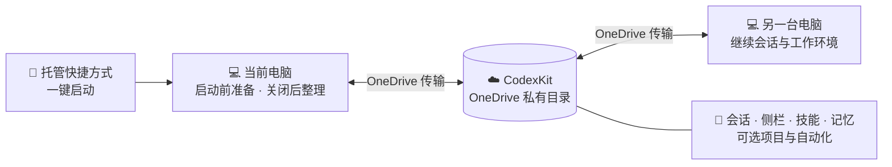

# Codex SyncKit

简体中文 | [English](README.md)

**一次安装，一键启动，把完整的 Codex 工作环境带到每一台 Windows 电脑。**

Codex SyncKit 通过 OneDrive 连接多台电脑，不需要手工创建目录链接，也不用自己
搬运隐藏文件夹，并让跨电脑使用 Codex 保持连贯：

- **🚀 一键启动：** 安装一次后，只需点击开始菜单中的 `ChatGPT` 快捷方式；启动前
  自动准备同步状态，关闭后自动整理。
- **🔄 同步全面：** 会话历史、侧栏与项目分组、技能、Hooks、全局指令、长期记忆和
  环境清单都能保持连续，项目工作区与自动化也可按需加入。
- **🧰 能力也能带走：** Codex 的可复用技能会一起同步，包括用于绘制流程图、架构图、
  示意图等内容的技能；换一台电脑后，不必重新搭建整套工作方法。

## 安装与使用

系统要求：Windows 10 或 11、Windows PowerShell 5.1 或更高版本、OneDrive、
Codex/ChatGPT 桌面应用或 Codex CLI，以及用于桌面状态辅助工具的 Node.js。
可选长期记忆子系统中的 Bash 维护工具需要 Git for Windows 或其他兼容的 Bash
运行环境。

1. 从 [Releases](https://github.com/wang22ti/codex-synckit/releases/latest)
   下载并解压最新 ZIP。
2. 双击 `Install-CodexSyncKit.cmd` 启动安装。

默认安装包含完整会话和侧栏组织，因此生成的 OneDrive `CodexKit` 目录应保持私有；
不要把它提交到公开仓库或放入公开共享链接。

安装器随后会询问是否加入长期记忆子系统，而且没有默认答案：必须输入 `Y` 或
`N`。无人值守安装则必须显式使用 `-InstallMemorySubsystem` 或
`-SkipMemorySubsystem`。选择不加入不会删除以前已经安装的副本或已有私人记忆。

安装器会自动判断当前是在**新建同步包**还是**加入已有同步包**：

- 第一次安装到新的空目录时，用当前电脑初始化 OneDrive 私有包。
- 在第二台或之后的电脑上发现已有 `CodexKit` 时，只加入这套共享数据，不会把
  本机已有的会话、侧栏、技能或记忆重新导出并覆盖 OneDrive 内容。
- 如果目标目录非空但无法识别为 CodexKit，安装器会停止，不猜测也不覆盖。

随后安装器会添加随包附带的 `codexkit-sync` 技能，应用推荐链接，并创建托管的
`ChatGPT` 快捷方式。会话和桌面状态同步默认开启；只有在相应内容需要保留在
本机时，才使用 `-ExcludeSessions` 或 `-ExcludeDesktopState`。

安装只需执行一次。以后从开始菜单点击托管的 `ChatGPT` 快捷方式即可一键启动，
同步准备和关闭后的整理会自动完成。

## 工作原理

1. 面对新的空目录时，安装器创建私有 `CodexKit` 并写入当前电脑选定的数据；
   面对已有同步包时，则直接加入，不把本机旧数据反向导出。
2. 安装器通过经过验证的目录链接、Hooks 和托管快捷方式，把每台 Windows 电脑
   连接到这套共享数据。
3. 安装过程中必须明确选择是否加入长期记忆子系统；直接按回车不会选择任何
   选项。
4. OneDrive 负责传输文件；Codex SyncKit 负责 Codex 专用的目录结构、校验、
   备份、冲突保护，以及启动和关闭时的同步协调。

需要替换本机目录时会先备份本机数据；已有 OneDrive 同步包不会在加入过程中被
重新初始化。遇到无法识别的目录、不支持的状态或冲突时，工具会安全停止。

## 同步什么

Codex SyncKit 根据 Codex 的数据结构工作，而不是把整个应用目录当作普通文件夹
同步。它只共享适合跨设备使用的状态，把本机状态留在本机，并在检测到不安全的
冲突时停止操作。

下表中的 `%USERPROFILE%` 表示当前 Windows 用户目录，`CodexKit\...` 表示
OneDrive 私有同步包中的位置。

| 类别 | 默认状态 | 本机来源 → OneDrive 位置 | 通俗解释 |
| --- | --- | --- | --- |
| 技能 | 开启 | `.codex\skills` → `CodexKit\skills` | 可重复使用的指令和工具，用来教 Codex 完成特定类型的任务 |
| Hooks | 开启 | `.codex\hooks.json` 及其脚本 → `CodexKit\hooks` | 在会话开始、提交提示词等事件发生时自动运行的命令；每台电脑仍需单独确认信任 |
| 全局指令 | 开启 | `.codex\AGENTS.md` → `CodexKit\rules\global` | 要求 Codex 在所有项目中都遵守的说明；它们不是命令审批规则 |
| 长期记忆子系统 | 安装时询问 | 子系统代码安装为 Codex 技能；私人记忆保存在项目 `.learnings` 和 `%USERPROFILE%\global-memory` | 负责记录、读取、整理和维护跨会话、跨项目的事实与经验 |
| 会话历史 | 开启 | `.codex\sessions`、`.codex\archived_sessions`、`.codex\session_index.jsonl` → `CodexKit\session-data` | 完整的当前及归档对话和标题索引，让另一台电脑能够重新打开并继续 |
| 侧栏和项目分组 | 开启 | `.codex\.codex-global-state.json` 中可跨设备使用的字段 → `CodexKit\desktop-state` | 任务标题、项目分组、任务属于哪个项目、描述、置顶和排序；**不包含项目的实际文件** |
| 项目工作区文件 | 可选 | `Documents\Codex` → `CodexKit\CodexProjects` | 硬盘上的真实文件夹和文件，包括源代码、文档、`.git`、`.agents` 和项目级 `.codex` 设置 |
| Codex 自动化 | 可选 | `.codex\automations` → `CodexKit\automations` | `automation.toml` 等自动化定义及其 `memory.md`；同一个共享计划只应由一台指定电脑执行 |
| 设备环境清单 | 开启 | 扫描当前电脑 → `CodexKit\environment\devices\<电脑名>.json` | 记录已安装工具及版本，用于比较电脑差异；不会安装或复制应用程序 |
| 插件清单 | 开启 | 读取 `.codex\plugins\cache` 中的名称和版本 → `CodexKit\plugins\inventory.json` | 用于提示另一台电脑缺少哪些插件；不会复制插件程序和缓存 |
| 脱敏配置快照 | 只记录，不自动应用 | `.codex\config.toml`、`*.config.toml` → `CodexKit\profiles` | 删除疑似密钥后的参考副本；模型、推理等级、功能开关、信任设置等实际偏好仍由每台电脑自行选择 |
| 凭据和仅限本机的运行状态 | 永不同步 | 不复制到 OneDrive | `auth.json`、`.codex\rules`、`state_5.sqlite`、Codex 日志、缓存、沙箱数据、信任记录、SSH 密钥、`.env` 和疑似密钥或令牌文件都留在本机 |

**补充说明**

- **长期记忆**
  - 由随项目提供的 [`memory-and-improvement`](subsystems/memory-and-improvement/README.zh-CN.md) 子系统管理，不是简单复制一个文件夹。
  - 项目记忆保存在 `.learnings`；跨项目记忆保存在 `global-memory`。
  - 项目 `.learnings` 只有在项目位于 OneDrive，或开启项目工作区同步时，才会跨电脑传输。
- **侧栏与项目工作区**
  - “侧栏和项目分组”同步项目和任务在 ChatGPT 中的显示与组织。
  - “项目工作区文件”同步硬盘上的真实文件夹和文件。
  - 即使未开启项目工作区文件同步，项目仍可能出现在另一台电脑的侧栏中。
- **隐私**
  - 会话历史、记忆、侧栏组织、环境报告和配置快照可能包含提示词、回答、长期事实、项目名称、软件信息和本地路径。
  - 请保持生成的 `CodexKit` 目录为私有目录，并阅读[隐私说明](docs/PRIVACY.md)了解数据边界。

## 与同步工具对比

下表比较的是同步 Agent 配置、上下文或工作状态的工具，不是在比较 Agent 本身。

| 工具 | 主要同步对象 | 跨设备方式 | 范围边界 |
| --- | --- | --- | --- |
| **Codex SyncKit** | Codex 会话、侧栏组织、技能、Hooks、全局指令、记忆、项目、自动化和环境清单 | OneDrive 私有目录 | 面向 Windows 上的 Codex 完整工作连续性，同时区分共享状态与本机状态 |
| [coding-agent-sync](https://marketplace.visualstudio.com/items?itemName=TCTinh.coding-agent-sync) | Claude Code 和 OpenCode 的设置、MCP、命令、Agent、技能与上下文包 | 加密的私有 GitHub Gist，通过 `push` / `pull` 传输 | OpenCode 支持导入导出便携上下文；Codex 支持仍标为“即将推出” |
| [agentsync](https://agentsync.cc/) | 把统一定义的 MCP、记忆、技能、子 Agent、命令、Hooks 和插件组件转换到多个编码 Agent 的原生格式 | 规范目录可纳入 dotfiles 或 Git，在各电脑执行 `apply` | 强项是跨 Agent 配置翻译和漂移处理，不同步会话历史或桌面侧栏 |
| [skillshare](https://github.com/runkids/skillshare) | 多种 AI CLI 的技能、Agent、规则、命令和其他文件型资源 | 可使用 Git remote 在电脑之间传输统一资源库 | 支持大量 Agent 和安全审计，但不处理会话、桌面状态或应用运行数据 |
| [agent-rules-sync](https://github.com/dhruv-anand-aintech/agent-rules-sync) | Claude、Cursor、Gemini、OpenCode、Codex 等工具的规则和技能，以及 Claude 设置与 Hooks | 本机守护进程在 Agent 目录和指定项目间同步；跨电脑仍需项目仓库等传输层 | 适合保持多种 Agent 的规则一致，不是会话连续性工具 |
| [Roo Code 设置管理](https://roocodeinc.github.io/Roo-Code/features/settings-management/) | Roo Code 的 Provider 配置、全局设置、自定义模式，以及可选的任务历史和存储目录 | 自动导入共享配置文件，或把自定义存储目录放入云盘 | 只面向 Roo Code；导出的设置文件可能包含明文 API 密钥 |
| [gstack brain sync](https://github.com/garrytan/gstack/blob/main/USING_GBRAIN_WITH_GSTACK.md) | gstack 的学习记录、计划、设计、复盘和开发者画像 | 私有 Git 仓库 | 专注跨电脑记忆与工作产物，不同步完整 Agent 配置、会话或界面状态 |

这些工具解决的问题并不完全相同：有的在多种 Agent 之间分发配置，有的只搬运
技能或记忆，有的负责跨电脑恢复上下文。Codex SyncKit 的范围则集中在同一套
Codex 桌面与 CLI 环境的跨电脑连续使用。

## 限制

**当前仍是早期 Alpha 版本。** 功能和兼容性还比较基础，可能仍有较多尚未发现的
Bug。按照以下规则顺序使用各台电脑，并依靠工具提供的备份、冲突检查和异常停止
机制，正常使用的风险总体可控；重要项目和数据仍建议保留独立备份。

- 换到另一台电脑前，先关闭 ChatGPT，并等待 OneDrive 显示 `CodexKit` 已同步
  完成。
- 不要在两台电脑上同时操作同一个已同步会话。
- 同一时间只运行一个托管 ChatGPT，并等待关闭后的同步完成。
- 不要公开或分享生成的私有 `CodexKit` 目录。
- 不要手工复制或链接凭据、命令审批规则、`state_5.sqlite`、缓存或日志。
- 如果出现 OneDrive 冲突副本或旧的“其他设备正在运行”警告，应先停止操作，
  确认哪台电脑拥有最新状态。

Alpha 版本聚焦于 Windows 和 OneDrive。Codex 的内部存储结构可能随桌面应用
版本变化；遇到不支持的布局时，工具会给出诊断并停止，而不是进行推测性修改。

**欢迎大家一起把 Codex SyncKit 做得更完整。** 当前尤其需要 Linux 和 macOS
支持，以及 OneDrive 之外的同步平台与后端。无论是平台适配、同步实现、测试还是
文档改进，都欢迎参照[贡献指南](CONTRIBUTING.md)参与开发。

隐私边界、恢复与移除方法见[隐私说明](docs/PRIVACY.md)、
[安全政策](SECURITY.md)和[卸载说明](docs/UNINSTALL.md)。本项目采用
[MIT 许可证](LICENSE)。

Codex SyncKit 是独立的社区项目，与 OpenAI 不存在隶属、赞助或官方认可关系。
OpenAI、ChatGPT 和 Codex 是其各自所有者的商标。本项目不分发 OpenAI 标志。
