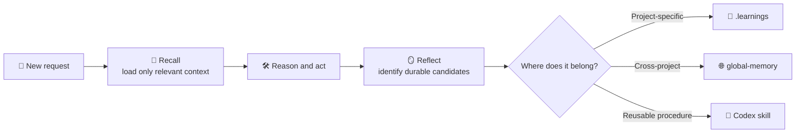

# memory-and-improvement

[简体中文](README.zh-CN.md) | English · [Back to Codex SyncKit](../../README.md)


**Give Codex durable memory without turning every observation into a permanent
rule.**

`memory-and-improvement` is the optional long-term memory subsystem bundled
with Codex SyncKit. It helps Codex recall useful context before work, capture
facts and lessons in the right scope, and review worthwhile outcomes before the
final response.

- **🧠 Two memory scopes:** Project-specific knowledge stays with the project;
  durable cross-project knowledge lives in a separate global namespace.
- **🔁 Closed-loop workflow:** Recall → reason → act → reflect, with the main
  session making every judgment.
- **🪜 Controlled promotion:** Raw observations are easy to capture, while
  summaries, structured global facts, and reusable skills require stronger
  evidence.
- **🧰 Practical maintenance:** Search, review, organization, asset indexing,
  optional Git history, and scheduled maintenance are included.

## Installation and use

The easiest installation path is the
[Codex SyncKit installer](../../README.md#installation-and-use). During setup it
asks explicitly whether to install this subsystem; there is no default answer.
Choosing No leaves the rest of Codex SyncKit fully usable.

After installation, the normal workflow is conversational:

1. At the beginning of a non-trivial turn, Codex decides whether relevant
   memory should be recalled.
2. During the task, stable facts, corrections, errors, and reusable lessons can
   become memory candidates.
3. Before the final response, meaningful work is reviewed for anything worth
   recording.

The `UserPromptSubmit` hook only reminds the main session to recall before
replying and reflect before the final response. It does not automatically read,
write, or promote memory.

For manual operation, the main entry points are:

```bash
# Initialize project and global memory
bash ~/.codex/skills/memory-and-improvement/scripts/bootstrap/init-memory.sh --scope both

# Recall the smallest relevant layer
bash ~/.codex/skills/memory-and-improvement/scripts/recall/recall-memory.sh --scope auto

# Review current memory
bash ~/.codex/skills/memory-and-improvement/scripts/recall/review-memory.sh --scope both
```

Configuration and maintenance commands are documented in the
[technical reference](TECHNICAL.md).

## How it works



The system intentionally separates capture from promotion:

1. **Recall:** Start with summaries and structured facts; inspect raw history
   only when deeper evidence is needed.
2. **Reason and act:** Use recalled context as guidance, not as an automatic
   command.
3. **Reflect:** Decide whether the completed work produced a durable fact,
   correction, lesson, error, or reusable procedure.
4. **Route:** Store project facts locally, cross-project facts globally, and
   repeatable procedures as skills.
5. **Maintain:** Optional maintenance organizes entries and suggests
   promotions, but does not silently make them authoritative.

## What it remembers

| Layer | Location | Purpose |
| --- | --- | --- |
| Project memory | `<project>/.learnings` | Repository-specific facts, conventions, errors, decisions, and lessons |
| Global memory | `~/global-memory/namespaces/<namespace>` | Durable facts and lessons that remain useful across projects |
| Structured facts | Files such as `PROFILE.md` or `PUBLICATIONS.md` | Stable factual snapshots that benefit from repeated loading |
| Indexed assets | `.learnings/assets/INDEX.md` or global `assets/INDEX.md` | Metadata pointing to PDFs, reports, figures, datasets, and other durable artifacts |
| Reusable skills | `~/.codex/skills/<skill>` | Procedures that should become repeatable Codex capabilities |
| Device-local state | Codex state and log directories | Maintenance timestamps, temporary markers, logs, and other machine-specific runtime data |

Raw memory may include private project details or personal facts. Keep project
memory and global memory private unless you have deliberately reviewed and
redacted them.

## Compared with other memory approaches

| Approach | Strength | Boundary |
| --- | --- | --- |
| Prompt-only instructions | Simple and immediately visible | Must be repeated or manually maintained; weak history and scope separation |
| Project notes such as `AGENTS.md` | Clear repository guidance | Best for current rules, not chronological evidence, errors, or cross-project facts |
| A single global memory file | Easy to search | Mixes unrelated projects and encourages overloading every turn with context |
| **memory-and-improvement** | Separates project, global, factual, asset, and skill layers; supports recall and maintenance | More moving parts; still depends on the main session making good recall and promotion decisions |

This subsystem complements `AGENTS.md`: current repository instructions belong
there, while evidence, corrections, chronology, and tentative lessons belong in
memory until they are mature enough to promote.

## Limitations

**This subsystem is still alpha software.** The workflow is usable, but the
scripts, heuristics, and platform integration may contain undiscovered bugs.

- Hooks provide reminders only; they do not guarantee that the model will
  recall, reflect, or log the right item.
- Bash-based tools require Git for Windows, WSL, Linux, macOS, or another
  compatible Bash environment.
- Project memory crosses devices only when the project itself is stored in a
  synchronized location or included in project-workspace synchronization.
- Automatic organization and promotion suggestions are advisory. Important
  facts should be reviewed before being promoted.
- Memory can contain sensitive material. Do not commit private `.learnings` or
  global-memory contents to a public repository.
- Large memory collections need periodic organization to keep recall focused
  and fast.

For configuration, script-by-script behavior, environment variables, Git
integration, maintenance, and complete examples, see the
[technical reference](TECHNICAL.md). Hook setup is covered
separately in [Hook setup](references/hooks-setup.md), and Windows scheduling in
[Windows maintenance](references/windows-maintenance.md).

The subsystem is distributed under the repository's [MIT License](../../LICENSE).
