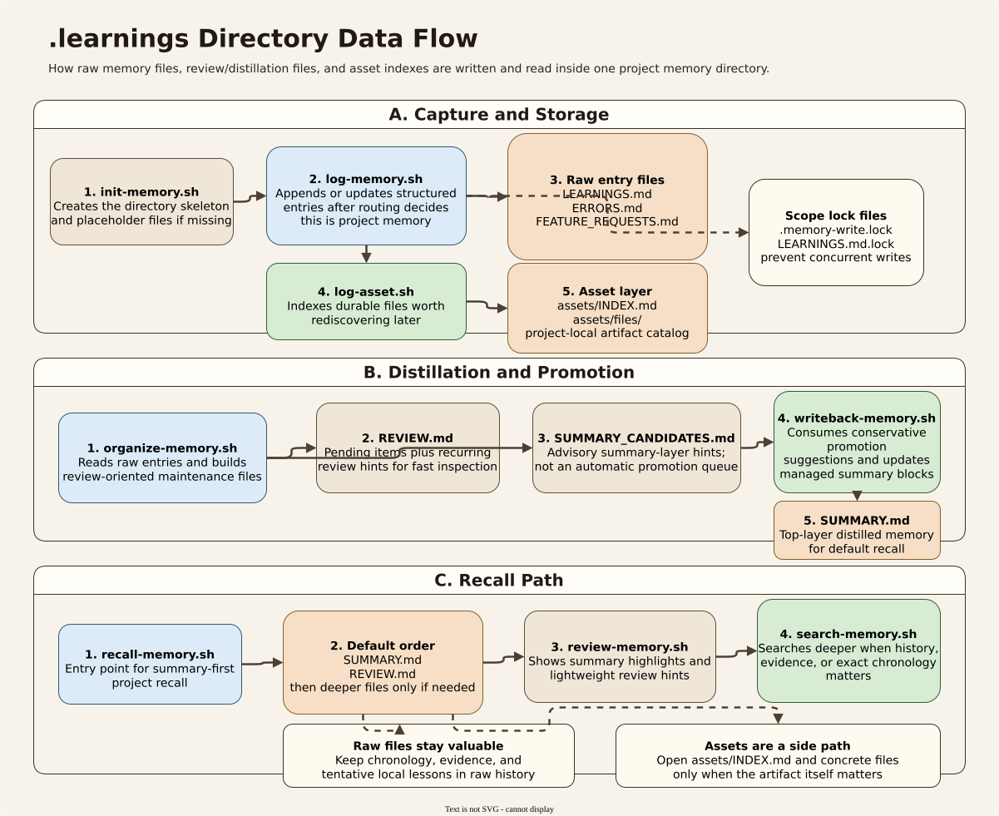
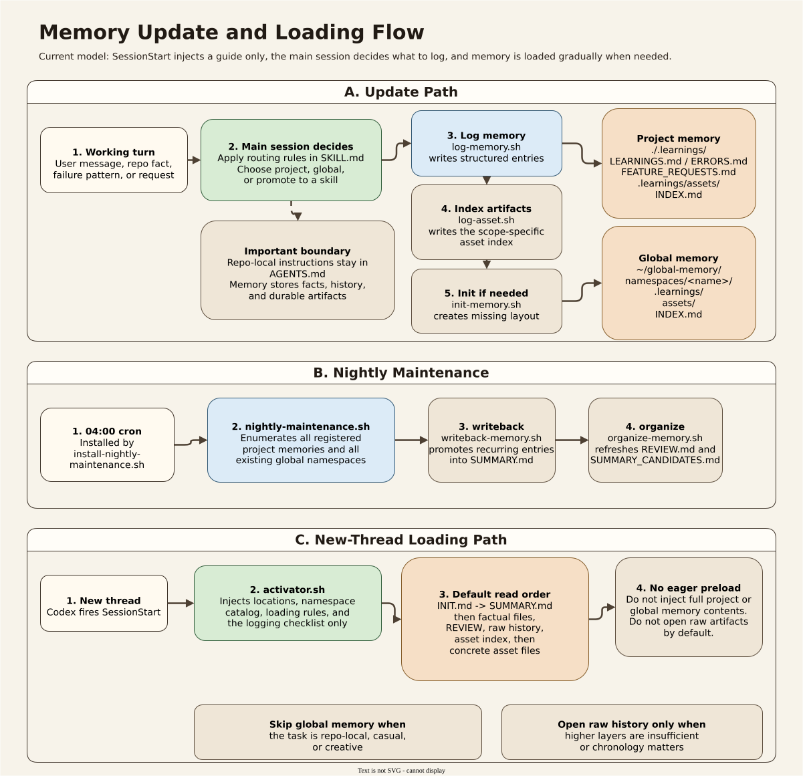

# memory-and-improvement

Codex-only memory skill for capturing project-local memory, cross-project global memory, and reusable procedures that should graduate into standalone Codex skills.

This README is written for a human maintainer. It explains the architecture, the intended workflows, the major scripts, the automation model, and the operational boundaries of the current implementation.

For the compact canonical maintainer policy reference, see [references/maintainer-reference.md](~/.codex/skills/memory-and-improvement/references/maintainer-reference.md). This README stays summary-first on purpose.

## What This Skill Is For

This skill gives Codex a structured way to remember:

- repo-specific facts, conventions, failures, and lessons
- cross-project facts, preferences, history, and durable workflow lessons
- reusable procedures that are important enough to become real Codex skills

It is designed around three memory layers:

- Project memory: default `./.learnings/` at the detected repo root
- Global memory: default `$HOME/global-memory/namespaces/<namespace>/.learnings/`
- Skills: default `$HOME/.codex/skills/`

The key idea is:

- facts and lessons stay in memory
- reusable procedures become skills
- global memory stores durable cross-project knowledge
- project memory stores repo-specific knowledge
- repo-local agent instructions stay in `AGENTS.md`, not in project memory

Capture favors recall. Promotion favors precision.
After this skill is active, make an explicit recall decision before every reply. Trivial chat may still skip by judgment, but the main session should keep that safe-skip judgment explicit internally without forcing a user-visible "no recall needed" message.

## Closed-Loop Runtime Model

The intended runtime model is:

1. Recall
   Make an explicit recall decision before each reply.
   Either start from the smallest relevant memory layer, or make an internal safe-skip judgment explaining why the turn is trivial or self-contained enough to skip recall safely.
2. Reason
   Decide whether the recalled layer is enough or whether deeper memory reads are needed.
   Use this checklist:
   What relevant memory did recall surface?
   If recall was skipped, why is that skip safe for this turn?
   Is the current layer enough?
   If not, should the next step be `review-memory.sh`, `search-memory.sh`, a structured factual file, or raw `.learnings/*.md`?
   Do repo conventions, prior failures, or the safe-skip judgment change the plan before edits begin?
   Use this escalation rule:
   summary hit and sufficient -> proceed
   summary hit but underspecified -> open `review-memory.sh` or a structured factual file
   no summary hit but clear history dependence -> use `search-memory.sh`
   chronology/evidence/debugging context/exact correction history needed -> open raw `.learnings/*.md`
   For memory-system meta questions, prefer the formal memory-system recall/review mode rather than inferring from the current repo first.
3. Respond/Act
   Answer or act while honoring the recalled constraints and repo conventions.
4. Reflect
   After meaningful work, make an explicit reflect decision.
   Either run a structured reflect check, or let the next `UserPromptSubmit` hook auto-run `reflect-memory.sh` for the previous completed turn if no reflect check was recorded before the next prompt.

Strict runtime standard:

- no silent recall skips inside the main session's reasoning
- no silent omission of reflect after meaningful work
- do not add user-visible "no recall needed" or "no reflect needed" filler unless that judgment materially affects the answer, plan, audit status, or logging outcome
- hooks and helper scripts may trigger or support these steps, but they do not make the judgment for the main session

For this repository, `memory-and-improvement` workflow, docs, specs, roadmap-driven implementation, and diagram edits are audit-sensitive. When runtime rules and user permission allow it, the repo convention is to run an audit-focused subagent before the work is treated as complete or before moving to the next phase. If that cannot happen, the gap should be stated explicitly instead of being silently ignored.
That audit convention should shape the plan before edits begin, not only at the very end.

Execution boundary for this repo:

- normal execution: replies, memory review/logging/search, and repo work that does not change `memory-and-improvement` workflow/docs/specs/roadmap/diagrams
- audit-aware execution: substantial `memory-and-improvement` workflow/docs/specs/roadmap/diagram changes that can alter the skill's behavior or maintainer contract

When work is audit-aware, the plan or commentary should say so before edits begin, keep the audit step in scope, and explicitly note if runtime rules or user permission prevent that audit from running.

Current truth-in-advertising note:

- the dedicated recall helper now exists as `scripts/recall/recall-memory.sh`
- the dedicated reflect helper now exists as `scripts/recall/reflect-memory.sh`
- the current hook setup injects runtime guidance on `SessionStart`, while `UserPromptSubmit` can auto-run `reflect-memory.sh` for the previous completed turn when no reflect check was recorded before the next prompt
- `suggest-promotions.sh` and `reflect-memory.sh` are advisory helpers, while nightly organize/writeback remains supportive distillation rather than authoritative promotion
- `scripts/maintenance/update-skill-policy.sh` is the only automatic rewrite path for `SKILL.md`, and it is limited to the managed routing-strategy block rather than the full skill body

## Quick Start

If you are using this system for the first time, you do not need to understand every layer.

Start with this minimal routing rule:

- repo-specific fact, convention, failure, or request -> project memory
- cross-project fact, preference, history, or durable lesson -> global memory
- reusable procedure -> skill
- not sure about promotion -> keep it in raw `.learnings/*.md` first
- not sure about scope -> default to project memory unless you already know it should help in a different repository next week
- not sure whether it is worth recording at all -> it is usually fine to capture it in `.learnings/*.md` first

For day-to-day logging, prefer the shortcut scripts under `scripts/shortcuts/` when one fits. For review, search, initialization, and promotion suggestion, use the core scripts directly.

## If You Are Unsure

The safest default is not “promote more.” The safest default is:

- log the item in raw `.learnings/*.md`
- choose project raw history by default unless the item is already clearly cross-project
- keep the wording simple and factual
- use `suggest-promotions.sh` later if the item starts to recur
- keep capture permissive and promotion selective

Non-promotion is normal in this system. Leaving something in raw history is often the correct final state.

## Common Examples

- “This repo stores fixtures in `tests/fixtures/`” -> project memory
- “The user prefers concise rebuttal drafts” -> global memory
- “This debugging session exposed a local integration failure” -> raw project `.learnings/*.md`
- “This exact workflow should be reused across repositories” -> consider a skill
- “This PDF or diagram file should be rediscoverable later” -> asset index for the matching scope

## Why This Memory System

This system is optimized for knowledge governance, not just convenience.

Compared with lighter memory systems, its main differences are:

- it routes memory explicitly across `project`, `global`, and `skill` layers instead of treating everything as one flat store
- it separates short loading hints, normalized factual files, chronological learnings, and durable artifacts
- it keeps the main session as the decision maker so noisy or low-value session residue does not flood the memory store
- it favors markdown, shell, and explicit indexes so the memory remains inspectable, grep-friendly, and easy to repair

In practice, that means:

- compared with Claude-style memory, this system is still heavier but now easier to maintain than earlier versions because stable policy, wrapper entrypoints, and drift checks are more centralized
- compared with retrieval-first systems such as OpenClaw-style memory, this system is less automatic but usually lower-noise, more explicit about promotion, and easier to govern as a layered archive
- compared with simple notes or flat long-term memory files, this system is more work to maintain but much better at separating facts, history, procedures, and assets

Relative to Claude-style memory, the current version leans harder into explicit governance:

- Claude-style systems are still smoother for lightweight project preferences and automatic day-to-day reuse
- this system is stronger when maintainers want visible routing boundaries, factual files, raw chronology, and artifact indexes to stay distinct
- this version also reduces some of its earlier maintenance drag by keeping stable policy in `references/maintainer-reference.md`, collecting convenience wrappers under `scripts/shortcuts/`, and adding `scripts/tests/docs-consistency-test.sh`

Relative to OpenClaw-style memory, the current version still makes the opposite trade:

- OpenClaw-style systems remain stronger for fuzzy recall and retrieval-first workflows
- this system is stronger when the goal is a low-noise, inspectable memory store where `SUMMARY.md`, factual files, raw `.learnings/*.md`, and asset indexes are different layers with different jobs
- the current version is also more explicit about artifact boundaries: project assets live under `.learnings/assets/INDEX.md`, while global namespace assets live under `assets/INDEX.md`

Where this system is strongest:

- long-lived research and project memory
- cross-project factual archives
- cases where `SUMMARY.md`, structured factual files, raw history, and assets should be treated differently
- workflows where correctness, auditability, and explicit boundaries matter more than frictionless capture

Where it is weaker:

- casual low-stakes memory
- fuzzy recall without structured cues
- zero-maintenance use cases where the user wants the system to remember everything automatically

### Comparison Table

| Dimension | This system | Claude-style memory | OpenClaw-style memory | Simple notes / flat memory |
|---|---|---|---|---|
| Core philosophy | governance-first | convenience-first | retrieval-first | capture-first |
| Write path | explicit main-session decision | lighter / more automatic | log-heavy / agent-driven | fully manual |
| Noise control | high | medium | low to medium | user-dependent |
| Structure depth | high | medium | medium | low |
| Fuzzy recall | medium | medium | high | low |
| Auditability | high | medium | medium | high |
| Cross-project governance | high | medium to high | medium | low |
| Artifact handling | high | limited to medium | implementation-dependent | low |
| Onboarding cost | high | low | medium | low |
| Maintenance cost | medium | low | medium | low |
| Best fit | research / long-lived knowledge governance | general engineering collaboration | long-running agent retrieval | personal scratch memory |

### Relation to Agent-Memory Research

The comparisons above are mostly product- and workflow-oriented.
Relative to the agent-memory literature, this skill is doing something narrower and more operational:
it is not trying to be a general autonomous agent architecture, a social simulator, or a context-window manager.
It is a maintainer-governed memory layer for real coding and research sessions.

The closest high-level resemblance is:

- to `Inner Monologue`, `ReAct`, and `Reflexion` in that it uses a closed loop instead of one-shot prompting
- to `Generative Agents` in that it distinguishes raw experiences from synthesized higher-level reflections
- to `MemoryBank` and `MemGPT` in that it treats memory as a persistent resource rather than only current-context prompt text
- to `Voyager` in that reusable procedures should graduate into a skill-like library instead of remaining as flat notes

But the main design choice here is different:

- those works mostly optimize autonomous task performance, believable behavior, adaptation, or context scaling
- this skill optimizes governance, inspectability, promotion discipline, and scope routing across `project`, `global`, and `skill`

Compared with these papers and systems, the main strengths of this skill are:

- explicit routing boundaries between repo-local memory, cross-project memory, and reusable procedures
- summary-first progressive loading instead of always retrieving or replaying everything
- durable markdown records that remain grep-friendly and manually repairable
- promotion rules that treat raw history, summaries, factual files, assets, and skills as different layers with different jobs
- human-auditable operation where the main session remains the decision maker

The main weaknesses are the mirror image of those strengths:

- it is less autonomous than agent architectures that learn through trial-and-error loops
- it is weaker at fuzzy recall and dynamic context packing than retrieval-first or paging-oriented systems
- it does not try to simulate believable social agents or optimize embodied exploration
- it asks more of the maintainer because capture, promotion, and policy boundaries remain explicit

### Comparison to Specific Works

| Work | What that work mainly optimizes | How this skill differs | Where this skill is stronger | Where it is weaker |
|---|---|---|---|---|
| [Inner Monologue](https://arxiv.org/abs/2207.05608) | closed-loop language feedback for embodied planning and robotics | this skill uses a closed loop for repo memory governance rather than online robot control | clearer persistence, explicit routing, inspectable history | much weaker for real-time embodied feedback and control |
| [ReAct](https://arxiv.org/abs/2210.03629) | interleaving reasoning and acting for task solving | this skill adds durable memory layers and promotion rules around the loop | stronger long-term memory governance and auditability | less lightweight for single-task acting, less action-centric |
| [Reflexion](https://arxiv.org/abs/2303.11366) | verbal reinforcement through reflective episodic memory across trials | this skill treats reflection as persistent governed memory work, not mainly a reward-improvement mechanism | lower noise, better human inspection, better repo alignment | weaker autonomous self-improvement speed and trial-to-trial adaptation |
| [Generative Agents](https://arxiv.org/abs/2304.03442) | believable human-like behavior through observation, planning, and reflection | this skill borrows the raw-memory vs reflection split but targets coding/research maintenance instead of simulated societies | stronger scope control, artifact indexing, and maintainability | not designed for believable social simulation or autonomous daily planning |
| [MemoryBank](https://arxiv.org/abs/2305.10250) | long-term user memory and personality adaptation in companion-style dialogue | this skill is less about user modeling and more about governed project/global memory | stronger boundaries, promotion discipline, and reusable-procedure extraction | weaker personalization, empathy adaptation, and forgetting-style memory shaping |
| [Voyager](https://arxiv.org/abs/2305.16291) | open-ended embodied lifelong learning with an automatic curriculum and executable skill library | this skill also graduates reusable procedures into skills, but does not autonomously explore or self-curriculum | stronger human oversight, repo fit, and archival clarity | much weaker open-ended learning and autonomous skill acquisition |
| [MemGPT](https://arxiv.org/abs/2310.08560) | hierarchical memory management for fixed-context LLMs via paging and interrupts | this skill's layers are semantic and governance-oriented rather than virtual-memory tiers for context extension | stronger inspectable archive design and promotion policy | weaker automatic context packing, paging, and large-context task support |

### Unified Research Comparison Table

| System | Memory unit | Update rule | Retrieval policy | Autonomy style | Governance style | Best-fit domain |
|---|---|---|---|---|---|---|
| This skill | raw learnings, summaries, factual files, assets, skills | explicit capture; conservative promotion; reusable procedures become skills | summary-first progressive loading, then deeper search only when needed | human-in-the-loop coding assistant workflow | maintainer-governed, scope-routed, audit-aware | coding and research sessions with durable project/global memory |
| [Inner Monologue](https://arxiv.org/abs/2207.05608) | running language feedback tied to environment interaction | updated from action-observation loop during control | use the current loop state and environment feedback | embodied closed-loop acting | task-policy oriented | robotics and embodied planning |
| [ReAct](https://arxiv.org/abs/2210.03629) | interleaved reasoning traces and actions | updated step by step during task execution | retrieve external information during acting when needed | task-solving agent loop | prompt/procedure oriented | question answering and interactive decision making |
| [Reflexion](https://arxiv.org/abs/2303.11366) | reflective verbal episodes from prior attempts | append reflections after success/failure signals across trials | reuse prior reflections in later attempts | self-improving trial loop | performance-improvement oriented | repeated task solving and agent improvement |
| [Generative Agents](https://arxiv.org/abs/2304.03442) | natural-language memories, reflections, plans | accumulate observations, synthesize reflections, derive plans | retrieval by relevance, recency, and importance | semi-autonomous social simulation | behavior-simulation oriented | believable social agents and daily activity simulation |
| [MemoryBank](https://arxiv.org/abs/2305.10250) | dialogue memories and user-profile-like long-term traces | write conversation-derived memories with forgetting-style dynamics | retrieve memories relevant to current dialogue and persona | conversational adaptation | user-model oriented | long-term personalized dialogue |
| [Voyager](https://arxiv.org/abs/2305.16291) | executable skills, curriculum history, environment feedback | add skills and curriculum knowledge during open-ended exploration | retrieve relevant skills for the current embodied task | autonomous exploration and lifelong learning | skill-library growth oriented | open-ended embodied agents |
| [MemGPT](https://arxiv.org/abs/2310.08560) | hierarchical context tiers, virtual-memory-like buffers | move information across memory tiers using managed paging | page the right information into the active context window | context-managed assistant loop | system/runtime oriented | long-context chat and document analysis |

This table is the shortest honest summary of the difference:

- most of these systems optimize autonomous adaptation, task performance, or context management
- this skill optimizes explicit long-term memory governance for real repositories and real maintainers
- so it wins on inspectability and promotion discipline, and loses on autonomy, fuzzy retrieval, and automatic context packing

One concise way to frame it is:

- `ReAct` and `Inner Monologue` make the loop explicit
- `Reflexion` makes verbal self-improvement explicit
- `Generative Agents` makes memory synthesis explicit
- `MemoryBank` and `MemGPT` make persistent memory management explicit
- `Voyager` makes reusable skill accumulation explicit
- this skill combines small pieces of all of those ideas, but re-targets them toward governed coding-session memory rather than benchmark agent autonomy

## Maintainer Reference

This README is the human-facing overview, not the full canonical policy document.

Use [references/maintainer-reference.md](~/.codex/skills/memory-and-improvement/references/maintainer-reference.md) when you need the compact source for:

- routing boundaries
- progressive loading order
- promotion rules
- asset policy
- anti-overpromotion guidance

The intent is:

- `SKILL.md` stays focused on runtime behavior
- this README stays readable
- the maintainer reference carries the stable policy language that would otherwise drift across files

## Anti-Overpromotion

Not everything should be promoted.

Most items should remain in raw `.learnings/*.md`, and that is a success condition rather than a backlog.

Promote only when there is a clear payoff:

- the item is durable
- the item is repeatedly useful
- a higher layer would noticeably improve future loading

Keep items raw when chronology, evidence, tentativeness, or local context are part of the value.
Index assets only when the file itself is worth rediscovering.

## Current Status

At the current version, the main day-to-day workflow is basically usable:

- project/global memory initialization works
- project/global routing works
- review and recall work
- recurring entries can be reviewed and conservatively promoted into `SUMMARY.md`
- nightly maintenance can be scheduled through cron
- git tracking for memory changes works

The current implementation still uses the same shell-and-markdown foundation, but the closed-loop redesign is now in place:

- one compact maintainer reference now carries the stable policy language
- the loop contract is now explicit in the docs and runtime guidance
- dedicated recall and reflect helpers now exist for the two loop edges that used to be the weakest
- thin wrappers live in one obvious folder under `scripts/shortcuts/`
- `suggest-promotions.sh` reduces scanning cost without becoming an autopilot
- writeback now follows advisory promotion plus thresholding instead of bypassing review with raw recurrence alone
- `scripts/tests/docs-consistency-test.sh` catches lightweight drift across docs and scripts
- anti-overpromotion is now explicit, so leaving items in raw `.learnings/*.md` is treated as normal
- asset indexing is scope-specific: project assets live under `.learnings/assets/INDEX.md`, while global namespace assets live under `assets/INDEX.md`

The system has been hardened across many edge cases, especially:

- project/global isolation
- recurring entry updates
- nightly writeback consistency
- git autocommit fallback identity
- path canonicalization
- promotion and summary generation

It is still a shell-and-markdown system, so it is not a database and not a perfect transactional store. But for normal usage, the major workflows are now in good shape.

## Mental Model

Think of the system as four layers:

1. Routing and path resolution
   Decides where memory should live and enforces project/global isolation.

2. Structured logging
   Writes normalized entries into markdown files with stable IDs and recurrence metadata.

3. Recall and distillation
   Reads memory back, shows concise recall/review snapshots, and conservatively distills eligible summary candidates.

4. Automation and persistence
   Hooks, nightly maintenance, and git integration keep the memory store updated over time without pretending that guidance, advisory tools, and enforced behavior are the same thing.

## Directory Layout

### Project Memory

By default:

```text
<repo-root>/
└── .learnings/
    ├── LEARNINGS.md
    ├── ERRORS.md
    ├── FEATURE_REQUESTS.md
    ├── REVIEW.md
    ├── SUMMARY.md
    ├── SUMMARY_CANDIDATES.md
    ├── assets/
    │   └── INDEX.md
    └── .gitignore
```

#### Project Memory Data Flow



This figure shows the internal job split inside one project `.learnings/` directory:

- `LEARNINGS.md`, `ERRORS.md`, and `FEATURE_REQUESTS.md` are the raw structured history layer
- `REVIEW.md` and `SUMMARY_CANDIDATES.md` are maintenance and advisory distillation layers
- `SUMMARY.md` is the top recall layer
- `assets/INDEX.md` and `assets/files/` are the artifact-discovery side path

The intended read path is still progressive: `SUMMARY.md` first, then `REVIEW.md`, then deeper raw history and assets only when the task actually needs them.

### Global Memory

By default:

```text
$HOME/global-memory/
├── README.md
└── namespaces/
    ├── research-principle/
    │   ├── README.md
    │   ├── INIT.md
    │   ├── SUMMARY.md
    │   ├── assets/
    │   │   └── INDEX.md
    │   └── .learnings/
    ├── research-ops/
    │   ├── README.md
    │   ├── INIT.md
    │   ├── SUMMARY.md
    │   ├── assets/
    │   │   └── INDEX.md
    │   └── .learnings/
    ├── research-history/
    │   ├── README.md
    │   ├── INIT.md
    │   ├── SUMMARY.md
    │   ├── RECORDS.md
    │   ├── assets/
    │   │   └── INDEX.md
    │   └── .learnings/
    ├── project/
    │   ├── README.md
    │   ├── INIT.md
    │   ├── SUMMARY.md
    │   ├── RECORDS.md
    │   ├── assets/
    │   │   └── INDEX.md
    │   └── .learnings/
    └── user-profile/
        ├── README.md
        ├── INIT.md
        ├── SUMMARY.md
        ├── PROFILE.md
        ├── ACADEMIC_PROFILE.md
        ├── PUBLICATIONS.md
        ├── FUNDING_HISTORY.md
        ├── assets/
        │   └── INDEX.md
        └── .learnings/
```

### Skills

```text
$HOME/.codex/skills/
└── <skill-name>/
    └── SKILL.md
```

## Routing Rules

Use this order:

1. Is the main value a reusable procedure?
2. If not, would this still help in a different repo next week?

Route accordingly:

- Reusable procedure: extract/update a skill
- Cross-project durable fact or lesson: global memory
- Repo-specific fact, convention, failure, or request: project memory

Important boundary:

- Project memory is for repo facts and distilled lessons, not for repo-local agent instructions or prompt/routing policy
- Repo-local operating policy belongs in `AGENTS.md` or explicit repo config
- Global memory may include cross-project initialization guidance that should be recalled early in a session

Examples:

- “This repo stores fixtures in `tests/fixtures/`” -> project memory
- “The user prefers concise rebuttal drafts” -> global `research-principle`
- “This API often fails behind a proxy” -> global `research-ops`
- “A lab-level proposal was submitted in 2025 and is still under review” -> global `research-history`
- “Regenerate clients after schema changes, then validate X, Y, Z” -> skill candidate

Structured factual files are the middle layer between `SUMMARY.md` and `.learnings/`.

- use `.learnings/*.md` for raw capture, corrections, chronology, and evidence
- use `SUMMARY.md` for very short top-layer loading hints
- use factual files such as `PROFILE.md`, `PUBLICATIONS.md`, or `RECORDS.md` for normalized durable facts that will be loaded repeatedly

Default promotion flow:

1. Log the fact in `.learnings/*.md`.
2. Promote it into a structured factual file when it becomes clearly stable or repeatedly needed.
3. Keep `SUMMARY.md` short and let it point at the factual file when appropriate.
4. Use `suggest-promotions.sh` and `SUMMARY_CANDIDATES.md` as advisory review layers, not as proof that promotion must happen.

If the factual file itself should be rediscoverable as an artifact, you can also index it as an asset. This is useful for files such as `FUNDING_HISTORY.md` or `PUBLICATIONS.md` when the file path itself matters for later retrieval.

## Core Invariants

The implementation now tries to preserve these invariants:

- Project and global memory must be isolated
- Equivalent paths must be canonicalized before comparison
- Global memory overrides must still respect `.learnings/` directory shape
- Repeated items should update recurrence instead of duplicating entries
- Repeated high-value items can be promoted into `SUMMARY.md`
- Nightly output should be internally consistent after writeback
- Git automation should work even when external git identity is missing

The most important hard guard is project/global isolation. The system now rejects overlapping or alias-equivalent paths such as:

- `project/.learnings`
- `project/../project/.learnings`

## Data Model

The system writes three kinds of entries:

- learnings
- errors
- feature requests

All entries are markdown blocks with:

- stable ID
- logged timestamp
- priority
- status
- freeform body
- recurrence metadata

### Learnings

Stored in `LEARNINGS.md`.

Typical fields:

- category
- summary
- details
- suggested action

### Errors

Stored in `ERRORS.md`.

Typical fields:

- summary
- error text
- context
- suggested fix
- reproducible

### Feature Requests

Stored in `FEATURE_REQUESTS.md`.

Typical fields:

- requested capability
- user context
- complexity estimate
- suggested implementation

### Recurrence Metadata

Entries can carry:

- `Pattern-Key`
- `Recurrence-Count`
- `First-Seen`
- `Last-Seen`
- `Recurrence Notes`

The logger uses the pattern key to detect the same issue recurring over time.

## Entry Lifecycle

A typical item moves through these states:

1. Logged as `pending`
2. Possibly updated by recurrence
3. Optionally promoted into `SUMMARY.md`
4. Possibly resolved or extracted into a skill

Important statuses currently recognized by the system:

- `pending`
- `in_progress`
- `resolved`
- `wont_fix`
- `promoted_to_summary`
- `promoted_to_skill`

If a previously resolved item recurs, the logger reopens it back to `pending`.

## Main Scripts

The `scripts/` tree is now grouped by function rather than kept flat:

- `scripts/bootstrap/`: initialization and directory/bootstrap setup
- `scripts/capture/`: write-path and extraction entrypoints
- `scripts/recall/`: summary-first recall, search, and reflect helpers
- `scripts/maintenance/`: distillation, writeback, git, and nightly maintenance
- `scripts/hooks/`: runtime hook entrypoints and hook-only utilities
- `scripts/shared/`: shared path and parser helpers used by multiple script groups
- `scripts/shortcuts/`: thin convenience wrappers over core scripts
- `scripts/tests/`: regression coverage for runtime behavior and doc drift

This split is meant to keep the runtime surface progressively loadable: start from the small group you need instead of treating `scripts/` as one flat namespace.

### `scripts/shared/memory-paths.sh`

Shared path and policy layer.

Responsibilities:

- detect project root
- resolve project/global memory directories
- validate namespaces
- canonicalize paths
- enforce project/global isolation
- expose common regexes and derived paths

This is the closest thing to the system's shared “runtime config layer”.

### `scripts/bootstrap/init-memory.sh`

Initializes project memory, global memory, or both.

Use it to create the directory and file structure without overwriting existing content.
It also initializes project `SUMMARY.md` with an `AGENTS.md` boundary reminder and creates namespace-level `INIT.md` files for curated global init context.

Examples:

```bash
bash ~/.codex/skills/memory-and-improvement/scripts/bootstrap/init-memory.sh --scope both --project-root "$PWD"
bash ~/.codex/skills/memory-and-improvement/scripts/bootstrap/init-memory.sh --scope project --project-memory-dir /path/to/.learnings
bash ~/.codex/skills/memory-and-improvement/scripts/bootstrap/init-memory.sh --scope global --global-defaults
```

### `scripts/capture/log-memory.sh`

Main write path.

Responsibilities:

- validate logging arguments
- initialize memory when needed
- choose destination file
- create IDs
- deduplicate via `Pattern-Key`
- update recurrence in-place
- reopen resolved entries if they recur
- optionally auto-commit through git

This is the most important operational script in the system.

### `scripts/recall/review-memory.sh`

Main read path for concise recall.

Responsibilities:

- show summary highlights
- show `REVIEW.md` highlights when available
- optionally fall back to pending/recent raw entry summaries only when higher layers are absent or explicitly requested
- keep the default snapshot lighter than opening raw `.learnings/*.md`

The main session can use this when it wants a concise snapshot before deciding whether to open deeper memory files.

### `scripts/recall/recall-memory.sh`

Dedicated summary-first recall entrypoint for the current turn.

Responsibilities:

- resolve `auto` into the smallest likely memory scope among `project`, `global`, or `both` after the main session has already decided memory is relevant
- show a concise review snapshot first
- optionally include `search-memory.sh` output when a query or deeper recall is requested
- keep recall lightweight while still allowing escalation

Use this when the main session wants one obvious recall command before reasoning about whether deeper memory reads are needed.

### `scripts/recall/reflect-memory.sh`

Dedicated advisory reflect entrypoint for meaningful turns, including the previous-turn auto-reflect path triggered from `UserPromptSubmit`.

Responsibilities:

- accept a short turn summary plus optional details
- suggest likely next actions such as `log_learning`, `log_error`, `log_feature_request`, `consider_summary`, `consider_skill`, or `no_action`
- stay advisory only so the main session remains the final decision maker

Use this when the main session wants a lightweight post-turn check before deciding whether to call `log-memory.sh`, keep the item raw, or consider later promotion/skill extraction.

### `scripts/maintenance/organize-memory.sh`

Creates maintenance reports:

- `REVIEW.md`
- `SUMMARY_CANDIDATES.md`

It does not mutate source entry statuses. It is intended as a maintenance/reporting layer.

### `scripts/maintenance/writeback-memory.sh`

Promotes only advisory `promote_to_summary` candidates that also clear the writeback recurrence threshold, while keeping already promoted summary entries pinned in managed `SUMMARY.md` blocks.

It is the distillation layer of the system, not an autopilot.

### `scripts/maintenance/update-skill-policy.sh`

Rewrites only the managed routing-strategy block in `SKILL.md`.

Its job is intentionally narrow: absorb high-signal corrections about routing, source priority, and promotion policy without allowing automation to rewrite the rest of the skill body.

### `scripts/maintenance/git-memory.sh`

Git integration layer.

Supports:

- `init`
- `status`
- `commit`

Behavior:

- project memory reuses an existing repo when possible
- project memory can also live in its own repo
- global memory uses the global memory tree repo
- commit identity now falls back to `Codex Memory <codex-memory@local>` if no explicit identity exists

### `scripts/maintenance/nightly-maintenance.sh`

Automation entry point.

Responsibilities:

- optional writeback
- organize reports
- optional git commit
- prune stale registered project memory entries when their directories no longer exist

Current order is intentionally:

1. writeback
2. organize
3. git commit

This keeps nightly outputs internally consistent while keeping nightly maintenance supportive rather than authoritative.

### `scripts/maintenance/install-nightly-maintenance.sh`

Installs or prints a cron entry.

Responsibilities:

- support both fixed daily schedules and interval-driven schedules
- freeze the effective global memory context into the cron command
- freeze recurrence threshold
- freeze writeback and git-autocommit flags
- write logs outside the global memory git tree
- render `$HOME/...` style paths in the cron command

In interval mode, it installs a lightweight cron probe plus `interval-maintenance.sh`, so execution can happen every `N` minutes or hours without relying on cron's 24-hour field divisibility.

Nightly project maintenance no longer depends on a single frozen project root alone.
It processes and summarizes every existing project memory directory that has been initialized or written through the structured logger and registered under the local state directory.
If a registered project memory directory has been deleted manually, nightly maintenance removes that stale registry entry automatically.
Nightly global maintenance now processes every existing namespace under `~/global-memory/namespaces/` by default; the configured namespace acts as a fallback when you are not using the standard namespace tree.

### `scripts/maintenance/interval-maintenance.sh`

Runs maintenance only when the requested interval has elapsed.

Responsibilities:

- keep a last-successful-run state file under the local state directory
- skip early cron probes when the interval has not elapsed yet
- skip due runs when no relevant project/global memory files changed since the last successful run
- call `nightly-maintenance.sh` only when due
- preserve the existing writeback / organize / git sequence once a run is due

### `scripts/hooks/activator.sh`

Session-start memory routing hook helper.

Default behavior:

- on `SessionStart`, inject only memory locations and loading rules, not actual project/global memory contents
- project memory remains the detected project root's `.learnings/` directory, even when that root is `~`
- when the detected project `.learnings/` directory already exists, `SessionStart` registers it for nightly project maintenance
- include a short memory-candidate checklist so the main session is reminded what kinds of items are worth considering for logging
- after this skill is active, require a recall step before every reply and start from the smallest relevant memory layer
- point the main session toward the closed-loop contract and the dedicated summary-first recall helper
- point the main session toward the advisory reflect helper for substantial turns

The `SessionStart` guide now makes the default read order explicit:

1. `INIT.md`
2. `SUMMARY.md`
3. structured factual files
4. `REVIEW.md`
5. detailed `.learnings/*.md`
6. asset index (`project: .learnings/assets/INDEX.md`; `global: assets/INDEX.md`)
7. concrete asset files

It also explicitly tells the main session when to skip global memory and when not to open raw `.learnings/*.md`.

Minimal regression check:

```bash
bash ~/.codex/skills/memory-and-improvement/scripts/tests/activator-sessionstart-test.sh
```

### `scripts/hooks/hook-utils.sh`

Shared helper layer used only by hook entrypoints.

Responsibilities:

- parse hook payloads and normalize runtime metadata
- keep hook-specific shell helpers out of `activator.sh`
- avoid duplicating hook plumbing inside capture or recall scripts

Keep hook-only utilities here instead of expanding the top-level hook entrypoints.

### `scripts/recall/search-memory.sh`

Structured memory search with staged progressive-loading behavior.

Supports:

- `--scope project|global|both`
- `--namespace <name>`
- `--type learning|error|feature_request|asset`
- `--status <status>`
- `--pattern-key <key>`
- `--query <text>`
- `--exhaustive true|false`

Priority order:

1. `INIT.md`
2. `SUMMARY.md`
3. structured factual files
4. `REVIEW.md`
5. raw `.learnings/*.md`
6. asset index (`project: .learnings/assets/INDEX.md`; `global: assets/INDEX.md`)

Default behavior stops after the first layer with hits, so higher-layer answers do not automatically force lower-layer scans.
Use `--exhaustive true` when you explicitly want a full cross-layer search.

Minimal regression check:

```bash
bash ~/.codex/skills/memory-and-improvement/scripts/tests/search-memory-test.sh
```

### `scripts/tests/recall-memory-test.sh`

Regression check for the dedicated recall entrypoint.

Use it to verify:

- summary-first recall behavior
- `auto` scope resolution
- raw `.learnings` stay hidden during default recall when summary/review layers are already sufficient
- query-driven escalation into search
- review output appears before search output

Run it with:

```bash
bash ~/.codex/skills/memory-and-improvement/scripts/tests/recall-memory-test.sh
```

### `scripts/tests/reflect-memory-test.sh`

Regression check for the advisory reflect entrypoint.

Use it to verify:

- correction -> `log_learning`
- failure -> `log_error`
- reusable workflow -> `consider_skill`
- no durable information -> `no_action`

Run it with:

```bash
bash ~/.codex/skills/memory-and-improvement/scripts/tests/reflect-memory-test.sh
```

### `scripts/maintenance/suggest-promotions.sh`

Suggests likely promotion targets without editing memory files.

Supports:

- `--scope project|global|both`
- `--namespace <name>`
- `--project-root <path>`
- `--limit <n>`

The current suggestion classes are:

- `promote_to_summary`
- `promote_to_factual_file`
- `consider_skill`
- `keep_raw`

Current suggestion sources:

- `.learnings/*.md` entry files
- `SUMMARY_CANDIDATES.md` when present
- `REVIEW.md` as a lightweight recurrence hint

This script is intentionally conservative. It is a suggestion layer, not an autopilot:

- it never edits memory files
- it keeps `keep_raw` visible by default so non-promotion remains normal
- it prefers deterministic heuristics over semantic retrieval in this phase

`writeback-memory.sh` should only consume conservative `promote_to_summary` suggestions that also clear the writeback threshold, while preserving existing `promoted_to_summary` entries.

Minimal regression check:

```bash
bash ~/.codex/skills/memory-and-improvement/scripts/tests/suggest-promotions-test.sh
```

### `scripts/maintenance/remove-project-memory.sh`

Safely retires a project memory directory.

Responsibilities:

- inspect the target project memory before removal
- preview entries that may deserve preservation in global memory or a skill before deletion
- stop by default when those candidates exist, so removal is reviewed rather than silent
- archive the project `.learnings/` directory under local state by default instead of immediately hard-deleting it
- unregister the project memory directory after archive or deletion

This script is intentionally conservative. It treats “remove” as a governance action, not just a filesystem action.
If you still want to continue after reviewing candidates, re-run it with `--allow-unpromoted-candidates true`.

Minimal regression check:

```bash
bash ~/.codex/skills/memory-and-improvement/scripts/tests/remove-project-memory-test.sh
```

### `scripts/tests/writeback-memory-test.sh`

Regression check for conservative summary writeback.

Use it to verify:

- advisory `promote_to_summary` candidates do get written back
- reusable workflow / `consider_skill` items do not get blindly promoted into `SUMMARY.md`

Run it with:

```bash
bash ~/.codex/skills/memory-and-improvement/scripts/tests/writeback-memory-test.sh
```

### `scripts/tests/update-skill-policy-test.sh`

Regression check for the managed `SKILL.md` routing-strategy writeback path.

Run it with:

```bash
bash ~/.codex/skills/memory-and-improvement/scripts/tests/update-skill-policy-test.sh
```

### `scripts/tests/nightly-maintenance-test.sh`

Regression check for the config-driven nightly writeback path.

Use it to verify:

- config can turn on nightly writeback without extra CLI flags
- explicit `--writeback false` still overrides the config default
- missing registered project-memory paths get pruned automatically during nightly maintenance

Run it with:

```bash
bash ~/.codex/skills/memory-and-improvement/scripts/tests/nightly-maintenance-test.sh
```

### `scripts/tests/log-memory-test.sh`

Regression check for config-driven `log-memory.sh` defaults.

Use it to verify:

- config can turn on `git_autocommit` for memory writes
- explicit `--git-autocommit false` still overrides config

Run it with:

```bash
bash ~/.codex/skills/memory-and-improvement/scripts/tests/log-memory-test.sh
```

### `scripts/capture/log-asset.sh`

Indexes durable artifacts into the correct asset index: project memory uses `.learnings/assets/INDEX.md`, while global namespaces use `assets/INDEX.md`.

Use it for PDFs, screenshots, datasets, and also for structured factual files when the file itself should be rediscoverable as an artifact by canonical path.

Supported types include:

- `paper_pdf`
- `supplementary_pdf`
- `slide_deck`
- `figure_source`
- `screenshot`
- `report_pdf`
- `dataset_snapshot`
- `structured_fact_file`
- `other`

Minimal regression check:

```bash
bash ~/.codex/skills/memory-and-improvement/scripts/tests/log-asset-test.sh
```

### `scripts/shortcuts/`

Thin convenience wrappers live in one place so the script tree stays predictable.

Current shortcuts:

- [`scripts/shortcuts/remember-project-fact.sh`](~/.codex/skills/memory-and-improvement/scripts/shortcuts/remember-project-fact.sh)
  - wraps `log-memory.sh` with default `--scope project --type learning --category insight`
- [`scripts/shortcuts/remember-global-fact.sh`](~/.codex/skills/memory-and-improvement/scripts/shortcuts/remember-global-fact.sh)
  - wraps `log-memory.sh` with default `--scope global --type learning --category insight`
- [`scripts/shortcuts/remember-error.sh`](~/.codex/skills/memory-and-improvement/scripts/shortcuts/remember-error.sh)
  - wraps `log-memory.sh` with default `--scope project --type error`
- [`scripts/shortcuts/index-factual-file.sh`](~/.codex/skills/memory-and-improvement/scripts/shortcuts/index-factual-file.sh)
  - wraps `log-asset.sh` with default `--scope global --type structured_fact_file`
- [`scripts/shortcuts/index-asset.sh`](~/.codex/skills/memory-and-improvement/scripts/shortcuts/index-asset.sh)
  - wraps `log-asset.sh` with default `--scope project`

Each shortcut forwards additional arguments to the underlying core script, so explicit later flags can still override the defaults when needed.

Minimal smoke check:

```bash
bash ~/.codex/skills/memory-and-improvement/scripts/tests/shortcuts-smoke-test.sh
```

### `scripts/tests/docs-consistency-test.sh`

Fast grep-based documentation drift check.

Use it to catch simple mismatches across `README.md`, `README.zh-CN.md`, `SKILL.md`, `TODO.md`, the maintainer reference, and the current core script set.

It is a drift detector, not a semantic validator.

Run it with:

```bash
bash ~/.codex/skills/memory-and-improvement/scripts/tests/docs-consistency-test.sh
```

### `scripts/capture/extract-skill.sh`

Creates a skill scaffold from a reusable learning.

It now reads the canonical template block from:

- [`references/SKILL-TEMPLATE.md`](~/.codex/skills/memory-and-improvement/references/SKILL-TEMPLATE.md)

so the template asset is the real source of truth.

## Architecture by Flow



This diagram shows the current operating model:

- memory updates happen when the main session decides something is worth recording
- nightly maintenance distills all registered project memories and all existing global namespaces
- new threads receive a loading guide, and after this skill is active the main session performs a recall step before every reply

### 1. Logging Flow

```text
Main session
  -> decide whether memory should be logged
  -> decide project vs global scope
  -> follow the routing boundary defined in SKILL.md
  -> log-memory.sh
  -> memory-paths.sh
  -> init-memory.sh (if needed)
  -> LEARNINGS.md / ERRORS.md / FEATURE_REQUESTS.md
  -> optional git-memory.sh commit
```

### 2. Review Flow

```text
activator.sh
  -> memory location hints
  -> global memory catalog and loading guide
  -> <memory-session-guide> block
  -> no eager memory preload
```

### 3. Distillation Flow

```text
organize-memory.sh
  -> REVIEW.md
  -> SUMMARY_CANDIDATES.md

writeback-memory.sh
  -> SUMMARY.md
  -> source status -> promoted_to_summary

update-skill-policy.sh
  -> SKILL.md managed routing-strategy block only
```

### 4. Nightly Flow

```text
cron
  -> nightly-maintenance.sh
  -> all registered project memories
  -> all existing global namespaces
  -> writeback-memory.sh (optional)
  -> update-skill-policy.sh (optional, managed block only)
  -> organize-memory.sh
  -> git-memory.sh commit (optional)
```

## Parser Layer

The recall and distillation path uses:

- [`scripts/shared/memory-entry-parser.awk`](~/.codex/skills/memory-and-improvement/scripts/shared/memory-entry-parser.awk)

This parser extracts:

- ID
- Logged
- Priority
- Status
- Summary or Requested Capability
- Recurrence count

Important recent hardening:

- it no longer treats arbitrary `---` lines inside entry bodies as entry terminators
- entries are now parsed by entry header boundaries and EOF instead

That change matters because error logs and command output often contain separator lines.

## Git Model

There are two distinct git modes:

### Project Memory Git

- Reuses the enclosing repo if project memory lives inside one
- Otherwise can initialize `.learnings` as its own repo

### Global Memory Git

- Uses the global memory tree repo
- In standard global-root mode, commits the relevant namespaces tree and root README
- In custom global memory override mode, commits the custom namespace tree

## Nightly Maintenance

Linux and macOS use cron.

Recommended default:

```bash
bash ~/.codex/skills/memory-and-improvement/scripts/maintenance/install-nightly-maintenance.sh \
  --scope both \
  --hour 4 \
  --minute 0 \
  --writeback true
```

Optional interval example:

```bash
bash ~/.codex/skills/memory-and-improvement/scripts/maintenance/install-nightly-maintenance.sh \
  --scope both \
  --interval-hours 6 \
  --writeback true
```

What this installs:

- fixed mode: daily cron at the requested hour/minute
- interval mode: a lightweight cron probe that triggers `interval-maintenance.sh`, which only runs real maintenance after the configured interval elapses
- `scope=both`
- `writeback=true`
- `git-autocommit=false` by default
- logs at `${XDG_STATE_HOME:-$HOME/.local/state}/memory-and-improvement/logs/nightly-maintenance.log`

The generated cron command intentionally uses `$HOME`-style paths for readability and portability.
Interval mode also stores its last-successful-run marker under `${XDG_STATE_HOME:-$HOME/.local/state}/memory-and-improvement/`.

Windows uses Task Scheduler plus Git for Windows:

```powershell
powershell.exe -NoProfile -ExecutionPolicy Bypass -File `
  "$HOME\.codex\skills\memory-and-improvement\scripts\maintenance\install-windows-maintenance.ps1" `
  -Apply
```

The Windows installer reads the same resolved defaults, supports fixed and interval schedules, and runs the existing Bash maintenance core through Git Bash. See `references/windows-maintenance.md` for preview, overrides, logs, and verification.
The installer entrypoint is `scripts/maintenance/install-windows-maintenance.ps1`.
Cross-platform write locking is provided by `scripts/shared/file-lock.sh`, which falls back to atomic directory locks when `flock` is unavailable.

## Global Configuration

Global cross-project defaults can now live in one file:

- `~/.codex/skills/memory-and-improvement/config.toml`

This is a global config file for this skill only.
There is no project-local config file in this phase.
If the file is missing, the skill keeps its built-in defaults from `memory-and-improvement/config/defaults.toml`.
The loader intentionally supports only a small TOML subset for the keys listed below: fixed sections, quoted strings, booleans, integers, comments, and blank lines.

Precedence is:

1. CLI arguments
2. environment variables
3. global config file
4. built-in defaults

Built-in defaults come from the repo-shipped file:

- `memory-and-improvement/config/defaults.toml`

Derived path note:

- `log_dir` is a supported user-config override, but the built-in default still derives from `state_root/logs` unless you set `log_dir` explicitly in your user config
- `global_namespaces_root` defaults to `global_root/namespaces` unless you set it explicitly in your user config or environment

Supported config surface in this phase:

- `[paths]`
  - `global_root`
  - `global_namespaces_root`
  - `state_root`
  - `log_dir`
  - `codex_home`
  - `codex_skills_dir`
- `[defaults]`
  - `global_namespace`
  - `git_autocommit`
  - `nightly_writeback`
  - `skill_policy_writeback`
  - `organize_min_recurrence`
- `[maintenance]`
  - `scope`
- `[maintenance.schedule]`
  - `mode`
  - `hour`
  - `minute`
  - `interval_minutes`

Unknown or misspelled keys fail loudly instead of being ignored.

Compatibility notes:

- `SELF_IMPROVING_GLOBAL_MEMORY_DIR` remains an env-only escape hatch for directly targeting a specific global `.learnings` directory
- `global_namespace` is a fallback-only default for single-namespace commands; when you already know the correct namespace, prefer passing it explicitly instead of relying on the default bucket
- `XDG_STATE_HOME` still works as the env override entrypoint for the parent state directory; the skill still appends `/memory-and-improvement`
- built-in defaults keep `log_dir` derived from `state_root/logs`; only set `log_dir` in user config when you intentionally want a different location

Example:

```toml
[paths]
global_root = "$HOME/global-memory"
global_namespaces_root = "$HOME/global-memory/namespaces"
state_root = "$HOME/.local/state/memory-and-improvement"
codex_home = "$HOME/.codex"
codex_skills_dir = "$HOME/.codex/skills"

[defaults]
global_namespace = "research-principle"
git_autocommit = true
nightly_writeback = true
skill_policy_writeback = false
organize_min_recurrence = 2

[maintenance]
scope = "both"

[maintenance.schedule]
mode = "interval"
hour = 4
minute = 0
interval_minutes = 240
```

How scheduling defaults behave:

- with `mode = "fixed"`, `install-nightly-maintenance.sh` uses the configured `hour` and `minute` when you do not pass scheduling flags
- with `mode = "interval"`, the installer uses `interval_minutes` when you do not pass `--interval-minutes` or `--interval-hours`
- `nightly-maintenance.sh` and `interval-maintenance.sh` also use the configured `maintenance.scope` default when you do not pass `--scope`
- changing config later does not rewrite an existing crontab; re-run the installer to materialize new defaults into the generated cron entry
- the installer now materializes the resolved namespace and global-root defaults into the generated cron line, so later built-in/default-file edits do not silently retarget an already-installed job

## Hooks

This skill also supports Codex hook integration.

Typical split:

- `activator.sh` on `SessionStart`

Hook path reminder:

- the live hook entrypoint is `~/.codex/skills/memory-and-improvement/scripts/hooks/activator.sh`
- if an older local `hooks.json` still points at `~/.codex/skills/memory-and-improvement/scripts/activator.sh`, migrate it to `scripts/hooks/activator.sh`
- if your Codex runtime does not expand `~` in hook commands, use the absolute path instead

Recommended mental model:

- announce where project and global memory live at session start
- treat possible memory updates as candidates first, not as automatic logging
- consider logging when you see a durable preference, durable cross-project fact, repo-specific convention, recurring failure pattern, or real missing capability request
- use a short checklist: reusable procedure, cross-project next week, or repo-specific fact/pattern worth preserving
- let the main session decide whether something is worth capturing and whether it should stay raw or be promoted later
- let the main session decide whether it belongs in project memory or a global namespace
- when something should be remembered, call `log-memory.sh` directly
- after this skill is active, make an explicit recall decision before every reply and only go deeper when higher layers are insufficient

Important caveat:

the hook layer still depends on Codex runtime behavior. The shell scripts are reasonably hardened, but hook effectiveness still depends on what the runtime exposes.

## End-to-End Examples

### Project learning

1. Notice a repo-specific convention or failure pattern.
2. Log it to project memory with `log-memory.sh`.
3. Later load `SUMMARY.md` first, then `REVIEW.md`, then the raw project learning only if more detail is needed.

### Global user-profile fact

1. Capture the raw fact in `user-profile/.learnings/`.
2. Promote stable repeated facts into `PROFILE.md`, `ACADEMIC_PROFILE.md`, `PUBLICATIONS.md`, or `FUNDING_HISTORY.md`.
3. During later sessions, read `SUMMARY.md` first and open the factual file only when the profile detail is actually needed.

### Indexed paper PDF asset

1. Keep the artifact at a stable path.
2. Index it with `log-asset.sh` into the correct asset index for its scope.
3. Search or review the asset index first, then open the PDF only when the artifact itself is needed.

## Important Environment Variables

### Path and scope

- `SELF_IMPROVING_PROJECT_ROOT`
- `SELF_IMPROVING_PROJECT_MEMORY_DIR`
- `SELF_IMPROVING_GLOBAL_ROOT`
- `SELF_IMPROVING_GLOBAL_NAMESPACES_ROOT`
- `SELF_IMPROVING_GLOBAL_NAMESPACE`
- `SELF_IMPROVING_GLOBAL_MEMORY_DIR`

### Automation

- `SELF_IMPROVING_GIT_AUTOCOMMIT`
- `SELF_IMPROVING_NIGHTLY_WRITEBACK`
- `SELF_IMPROVING_ORGANIZE_MIN_RECURRENCE`

### Codex integration

- `CODEX_HOME`
- `SELF_IMPROVING_CODEX_SKILLS_DIR`

## Typical Workflows

### Initialize both project and global memory

```bash
bash ~/.codex/skills/memory-and-improvement/scripts/bootstrap/init-memory.sh --scope both --project-root "$PWD"
```

### Review current memory

```bash
bash ~/.codex/skills/memory-and-improvement/scripts/recall/review-memory.sh --scope project
bash ~/.codex/skills/memory-and-improvement/scripts/recall/review-memory.sh --scope both
```

### Log a learning

```bash
bash ~/.codex/skills/memory-and-improvement/scripts/capture/log-memory.sh \
  --scope project \
  --type learning \
  --category correction \
  --summary "This repo uses latexmk, not pdflatex" \
  --details "Builds fail when pdflatex is used directly" \
  --suggested-action "Call latexmk in automation and docs"
```

### Log an error

```bash
bash ~/.codex/skills/memory-and-improvement/scripts/capture/log-memory.sh \
  --scope project \
  --type error \
  --summary "Local dev server fails when port is occupied" \
  --error-text "listen EADDRINUSE: address already in use" \
  --context "Observed during npm run dev" \
  --suggested-fix "Detect and free the port before restart"
```

### Log a feature request

```bash
bash ~/.codex/skills/memory-and-improvement/scripts/capture/log-memory.sh \
  --scope project \
  --type feature \
  --capability "Add batch export command" \
  --user-context "Repeatedly needed during nightly reporting" \
  --suggested-implementation "Expose a CLI wrapper around the existing export pipeline"
```

### Organize and write back recurring memory

```bash
bash ~/.codex/skills/memory-and-improvement/scripts/maintenance/organize-memory.sh --scope both
bash ~/.codex/skills/memory-and-improvement/scripts/maintenance/writeback-memory.sh --scope both --min-recurrence 2
```

### Enable git tracking

```bash
bash ~/.codex/skills/memory-and-improvement/scripts/maintenance/git-memory.sh init --scope both
SELF_IMPROVING_GIT_AUTOCOMMIT=true bash ~/.codex/skills/memory-and-improvement/scripts/capture/log-memory.sh ...
```

### Extract a reusable skill

```bash
bash ~/.codex/skills/memory-and-improvement/scripts/capture/extract-skill.sh \
  review-memory \
  --source-file ~/.learnings/LEARNINGS.md \
  --learning-id LRN-YYYYMMDD-NNN
```

## What This System Is Not

It is not:

- a secret store
- a full-text database
- a transactional event log
- a replacement for repo docs or design docs
- a replacement for repo-local `AGENTS.md`
- a substitute for well-written standalone skills

Do not store:

- secrets
- tokens
- private keys
- raw environment dumps
- sensitive personal data that should not live in plain markdown

## Known Operational Boundaries

These are normal, expected boundaries rather than active breakages:

- hook behavior still depends on Codex runtime integration
- markdown is still the persistence format, so it is human-friendly rather than strongly typed
- heavy concurrent editing is safer than before, but this is not a full database
- maintenance reports are derived artifacts, not authoritative source records

## Maintainer Guide

If you maintain this system over time, optimize for consolidation and low-noise evolution rather than feature count alone.

Use this working order:

1. Update [references/maintainer-reference.md](~/.codex/skills/memory-and-improvement/references/maintainer-reference.md) first when a stable policy changes.
2. Keep [`SKILL.md`](~/.codex/skills/memory-and-improvement/SKILL.md) limited to runtime behavior and short guardrails.
3. Keep this README and `README.zh-CN.md` as human-readable summaries rather than full policy dumps.

Keep the script layout disciplined:

- keep the grouped layout stable: `bootstrap/`, `capture/`, `recall/`, `maintenance/`, `hooks/`, `shared/`, `shortcuts/`, `tests/`
- bootstrap logic belongs in `scripts/bootstrap/`
- write-path and extraction logic belongs in `scripts/capture/`
- recall/search/reflect logic belongs in `scripts/recall/`
- distillation, writeback, git, and nightly logic belong in `scripts/maintenance/`
- hook entrypoints and hook-only helpers belong in `scripts/hooks/`
- shared parser/path utilities belong in `scripts/shared/`
- thin convenience entrypoints stay under `scripts/shortcuts/`
- regression checks stay under `scripts/tests/`
- do not reimplement core behavior inside wrappers

Keep the resource boundary disciplined too:

- memory assets belong in the memory store, but the path is scope-specific: project memory uses `.learnings/assets/INDEX.md`, while global namespaces use `assets/INDEX.md`
- stable policy docs and templates belong under `references/`
- exported diagrams, images, and editable diagram sources may live under `assets/`

When behavior changes, sync all affected layers in the same pass:

- script behavior
- `SKILL.md`
- `README.md`
- `README.zh-CN.md`
- `TODO.md` phase status when a planned phase lands
- `references/maintainer-reference.md` when the change affects stable policy

Use the lightweight checks on every meaningful maintenance pass:

- `bash ~/.codex/skills/memory-and-improvement/scripts/tests/docs-consistency-test.sh`
- feature-specific shell tests such as `search-memory-test.sh`, `shortcuts-smoke-test.sh`, or `suggest-promotions-test.sh`

Treat these as standing maintenance rules:

- most items should remain in raw `.learnings/*.md`
- `suggest-promotions.sh` is advisory only and must not become automatic promotion
- diagrams should be reviewed with a subagent and with rendered output, not source alone
- when implementing TODO-driven changes for this skill, run a subagent audit before moving on
- when changing nightly or interval defaults in `config/defaults.toml`, also refresh the live crontab with `bash ~/.codex/skills/memory-and-improvement/scripts/maintenance/install-nightly-maintenance.sh --apply`

When you are unsure where to put a new rule:

- stable policy -> `references/maintainer-reference.md`
- runtime agent behavior -> `SKILL.md`
- human-facing explanation -> README files
- executable enforcement or regression protection -> scripts/tests

## Quick Start

If you just want to use it:

```bash
bash ~/.codex/skills/memory-and-improvement/scripts/bootstrap/init-memory.sh --scope both --project-root "$PWD"
bash ~/.codex/skills/memory-and-improvement/scripts/recall/review-memory.sh --scope project
bash ~/.codex/skills/memory-and-improvement/scripts/capture/log-memory.sh --scope project --type learning --summary "..." --details "..." --suggested-action "..."
bash ~/.codex/skills/memory-and-improvement/scripts/maintenance/install-nightly-maintenance.sh --scope both --hour 4 --minute 0 --writeback true
```

That gives you:

- initialized project/global memory
- review snapshots
- structured logging
- nightly maintenance at 04:00

## Related Files

- [`SKILL.md`](~/.codex/skills/memory-and-improvement/SKILL.md)
- [`scripts/shared/memory-paths.sh`](~/.codex/skills/memory-and-improvement/scripts/shared/memory-paths.sh)
- [`scripts/capture/log-memory.sh`](~/.codex/skills/memory-and-improvement/scripts/capture/log-memory.sh)
- [`scripts/recall/review-memory.sh`](~/.codex/skills/memory-and-improvement/scripts/recall/review-memory.sh)
- [`scripts/maintenance/organize-memory.sh`](~/.codex/skills/memory-and-improvement/scripts/maintenance/organize-memory.sh)
- [`scripts/maintenance/writeback-memory.sh`](~/.codex/skills/memory-and-improvement/scripts/maintenance/writeback-memory.sh)
- [`scripts/maintenance/update-skill-policy.sh`](~/.codex/skills/memory-and-improvement/scripts/maintenance/update-skill-policy.sh)
- [`scripts/maintenance/git-memory.sh`](~/.codex/skills/memory-and-improvement/scripts/maintenance/git-memory.sh)
- [`scripts/maintenance/nightly-maintenance.sh`](~/.codex/skills/memory-and-improvement/scripts/maintenance/nightly-maintenance.sh)
- [`scripts/maintenance/install-nightly-maintenance.sh`](~/.codex/skills/memory-and-improvement/scripts/maintenance/install-nightly-maintenance.sh)
- [`scripts/capture/extract-skill.sh`](~/.codex/skills/memory-and-improvement/scripts/capture/extract-skill.sh)
- [`references/SKILL-TEMPLATE.md`](~/.codex/skills/memory-and-improvement/references/SKILL-TEMPLATE.md)
