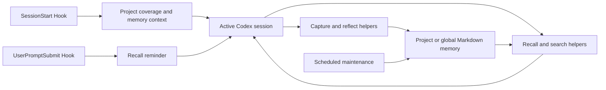

# memory-and-improvement

[简体中文](README.zh-CN.md) | English

**A Hook-integrated, Markdown-first memory runtime for Codex.**

This subsystem is not a standalone collection of shell commands. Its scripts
support the Codex Hook workflow: Hooks establish memory context and reminders,
the active Codex session invokes recall/capture helpers when needed, and the
scheduled maintenance task keeps the stored memory organized.

## Installation and use

Codex SyncKit installs the skill, Hook adapters, project registry, global
memory link, and optional maintenance task during normal Windows setup.

After installation, use Codex normally. No memory command needs to be run by
hand during ordinary work:

1. `SessionStart` identifies the current project, creates and registers its
   empty `.learnings` structure when necessary, and injects the available
   project and global memory locations.
2. `UserPromptSubmit` reminds the active Codex session to decide whether
   project or global memory is relevant. For an explicit identity/profile cue,
   the Windows adapter may also inject the small `user-profile/SUMMARY.md`
   layer.
3. Codex uses the bundled recall, search, capture, and reflect helpers only
   when the current task requires them.
4. The optional Windows scheduled task runs maintenance helpers outside the
   interactive session.

For a standalone installation, add the skill and configure `SessionStart`
plus, optionally, `UserPromptSubmit` as described in
[references/hooks-setup.md](references/hooks-setup.md).

## How it works



The Hooks do not silently decide general project-vs-global routing or invent
memory. The narrow exception is summary-first user-profile injection for an
explicit identity/profile cue. The active Codex session remains responsible
for each recall, skip, reflect, and write decision.

The supporting scripts are grouped by runtime role:

- `scripts/hooks/`: Hook-facing adapters and shared parsing.
- `scripts/recall/`: helpers Codex calls after a Hook reminder.
- `scripts/capture/`: structured logging and asset helpers.
- `scripts/bootstrap/`: project/global memory initialization.
- `scripts/maintenance/`: scheduled organization and writeback.
- `scripts/shortcuts/`: convenience wrappers around the same core helpers.

These are internal integration and diagnostic entry points, not a separate
end-user workflow.

## What it stores

| Layer | Default location | Purpose |
| --- | --- | --- |
| Project memory | `<project>/.learnings/` | Repository-specific history and guidance |
| Global memory | `~/global-memory/namespaces/<name>/.learnings/` | Durable cross-project knowledge |
| Summary | `SUMMARY.md` | Small, high-value loading layer |
| Raw records | `LEARNINGS.md`, `ERRORS.md`, `FEATURE_REQUESTS.md` | Chronology, evidence, and corrections |
| Assets | `.learnings/assets/INDEX.md` or `assets/INDEX.md` | Indexed supporting files |
| Reusable procedures | `~/.codex/skills/<skill>/` | Executable workflows |

Routing follows one rule:

1. Reusable procedures become skills.
2. Knowledge useful across repositories goes to global memory.
3. Repository-specific knowledge stays in project memory.

Capture favors recall; promotion favors precision.

## Maintenance

On Windows, normal maintenance is performed by the installed Task Scheduler
task. Manual script execution is intended for setup, verification, debugging,
or recovery.

Optional global configuration lives at:

```text
~/.codex/skills/memory-and-improvement/config.toml
```

Defaults live in `config/defaults.toml`. Detailed Hook configuration,
maintenance behavior, record formats, and script contracts are documented in:

- [references/hooks-setup.md](references/hooks-setup.md)
- [references/windows-maintenance.md](references/windows-maintenance.md)
- [references/maintainer-reference.md](references/maintainer-reference.md)
- [Full technical reference](docs/TECHNICAL.md)

## Limitations

- This is a Codex Hook subsystem, not a general-purpose memory CLI or automatic
  semantic RAG service.
- Empty structures cannot reconstruct history that was never recorded.
- Project and global memory must remain isolated.
- Credentials, raw secrets, and large unreviewed dumps do not belong in
  memory.
- Promotion is conservative: repeated text alone is not enough to create
  global memory or a skill.
