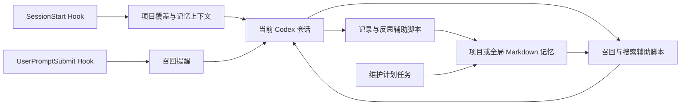

# memory-and-improvement

简体中文 | [English](README.md)

**一套配合 Codex Hook 运行、以 Markdown 为核心的长期记忆系统。**

它不是一组需要用户单独执行的 Shell 命令。这里的脚本服务于 Codex Hook
工作流：Hook 建立记忆上下文并给出提醒，当前 Codex 会话按需调用召回、记录和
反思辅助脚本，计划任务负责整理已经保存的记忆。

## 安装与使用

Codex SyncKit 的 Windows 常规安装会配置技能、Hook 适配器、项目注册表、全局
记忆链接，以及可选的维护计划任务。

安装完成后正常使用 Codex 即可，日常工作不需要手动运行记忆脚本：

1. `SessionStart` 识别当前项目，必要时创建并注册空的 `.learnings` 结构，同时
   注入项目记忆与全局记忆的位置。
2. `UserPromptSubmit` 提醒当前 Codex 会话判断本轮是否需要项目或全局记忆。
   遇到明确的身份/个人资料提示时，Windows 适配器还可能注入精简的
   `user-profile/SUMMARY.md`。
3. Codex 根据任务需要调用随附的召回、搜索、记录和反思辅助脚本。
4. 可选的 Windows 计划任务在交互会话之外运行维护脚本。

独立安装时，需要添加本技能，并按
[references/hooks-setup.md](references/hooks-setup.md) 配置
`SessionStart`，以及可选的 `UserPromptSubmit`。

## 工作原理



Hook 不会静默决定一般的项目/全局路由，也不会凭空编造记忆。唯一的窄例外是：
遇到明确的身份/个人资料提示时，优先注入 user-profile 摘要。每一次召回、跳过、
反思和写入决定仍由当前 Codex 会话负责。

辅助脚本按运行职责划分：

- `scripts/hooks/`：面向 Hook 的适配器和共享解析。
- `scripts/recall/`：Codex 收到 Hook 提醒后按需调用的召回辅助脚本。
- `scripts/capture/`：结构化记录与资产辅助脚本。
- `scripts/bootstrap/`：项目和全局记忆初始化。
- `scripts/maintenance/`：计划任务使用的整理与回写脚本。
- `scripts/shortcuts/`：对相同核心脚本的便捷封装。

这些是内部集成和诊断入口，不是另一套面向用户的独立工作流。

## 存储什么

| 层级 | 默认位置 | 用途 |
| --- | --- | --- |
| 项目记忆 | `<project>/.learnings/` | 仓库专属历史与指导 |
| 全局记忆 | `~/global-memory/namespaces/<name>/.learnings/` | 稳定的跨项目知识 |
| 摘要 | `SUMMARY.md` | 小而高价值的优先加载层 |
| 原始记录 | `LEARNINGS.md`、`ERRORS.md`、`FEATURE_REQUESTS.md` | 时间线、证据和纠正 |
| 资产 | `.learnings/assets/INDEX.md` 或 `assets/INDEX.md` | 支撑文件索引 |
| 可复用流程 | `~/.codex/skills/<skill>/` | 可执行工作流 |

路由遵循一个规则：

1. 可重复操作流程提炼成技能。
2. 跨仓库仍有用的知识写入全局记忆。
3. 仓库专属知识留在项目记忆中。

记录偏向高召回，升级偏向高精度。

## 维护

Windows 上的常规维护由安装好的计划任务完成。手动运行脚本只用于安装、验证、
排错或恢复。

可选全局配置文件：

```text
~/.codex/skills/memory-and-improvement/config.toml
```

默认值位于 `config/defaults.toml`。Hook 配置、维护行为、记录格式和脚本契约详见：

- [references/hooks-setup.md](references/hooks-setup.md)
- [references/windows-maintenance.md](references/windows-maintenance.md)
- [references/maintainer-reference.md](references/maintainer-reference.md)
- [完整技术基础文档](docs/TECHNICAL.zh-CN.md)

## 限制

- 这是 Codex Hook 子系统，不是通用记忆 CLI，也不是自动语义 RAG 服务。
- 空目录无法恢复以前从未记录过的历史。
- 项目记忆与全局记忆必须保持隔离。
- 凭据、原始密钥和未经筛选的大段输出不应进入记忆。
- 记忆升级必须保守；仅仅重复出现并不足以创建全局记忆或技能。
