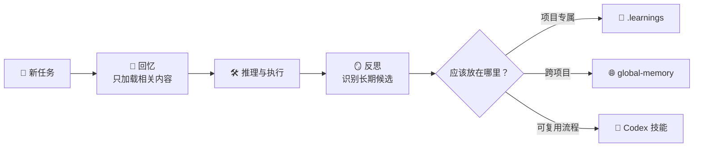

# memory-and-improvement

简体中文 | [English](README.md) · [返回 Codex SyncKit](../../README.zh-CN.md)


**让 Codex 拥有可持续的长期记忆，同时避免把每一次观察都变成永久规则。**

`memory-and-improvement` 是 Codex SyncKit 附带的可选长期记忆子系统。它帮助
Codex 在工作前回忆相关内容，把事实和经验放到正确的作用域，并在最终回答前检查
本轮是否产生了值得保留的新信息。

- **🧠 两层记忆：** 项目专属知识留在项目中；跨项目仍然有用的内容进入独立的
  全局命名空间。
- **🔁 闭环工作：** 回忆 → 推理 → 执行 → 反思，每一步都由主会话判断。
- **🪜 谨慎升级：** 原始观察可以宽松记录，但进入摘要、全局结构化事实或可复用
  技能需要更充分的依据。
- **🧰 完整维护：** 提供搜索、回顾、整理、资产索引、可选 Git 历史和定时维护。

## 安装与使用

最简单的安装方式是使用
[Codex SyncKit 安装器](../../README.zh-CN.md#安装与使用)。安装过程中会明确询问
是否加入该子系统，而且没有默认答案；选择否不会影响 Codex SyncKit 的其他功能。

安装后的日常流程主要由对话驱动：

1. 每个有实质内容的任务开始时，Codex 判断是否需要回忆相关记忆。
2. 工作过程中，稳定事实、用户纠正、错误和可复用经验可以成为记忆候选。
3. 最终回答前，Codex 检查本轮是否产生了值得记录的内容。

`UserPromptSubmit` Hook 只提醒主会话“回答前回忆、最终回答前反思”，不会自动
读取、写入或升级记忆。

需要手动操作时，主要入口只有三个：

```bash
# 初始化项目记忆和全局记忆
bash ~/.codex/skills/memory-and-improvement/scripts/bootstrap/init-memory.sh --scope both

# 读取最小的相关记忆层
bash ~/.codex/skills/memory-and-improvement/scripts/recall/recall-memory.sh --scope auto

# 回顾当前记忆
bash ~/.codex/skills/memory-and-improvement/scripts/recall/review-memory.sh --scope both
```

配置和维护命令统一放在[技术参考](TECHNICAL.zh-CN.md)中。

## 工作原理



系统有意把“记录”与“升级”分开：

1. **回忆：** 先看摘要和结构化事实，只有需要证据或历史时才深入原始记录。
2. **推理与执行：** 记忆提供上下文，不会自动变成必须执行的命令。
3. **反思：** 判断本轮是否产生了长期事实、纠正、经验、错误或可复用流程。
4. **路由：** 项目事实放项目记忆，跨项目事实放全局记忆，可复用流程提取成技能。
5. **维护：** 可选维护任务负责整理和提出升级建议，不会静默把候选变成权威规则。

## 记录什么

| 层级 | 位置 | 用途 |
| --- | --- | --- |
| 项目记忆 | `<项目>/.learnings` | 当前仓库专属的事实、约定、错误、决策和经验 |
| 全局记忆 | `~/global-memory/namespaces/<命名空间>` | 换到其他项目仍然有用的长期事实和经验 |
| 结构化事实 | `PROFILE.md`、`PUBLICATIONS.md` 等文件 | 适合反复读取的稳定事实快照 |
| 资产索引 | `.learnings/assets/INDEX.md` 或全局 `assets/INDEX.md` | 指向 PDF、报告、图片、数据集等长期资料的元数据 |
| 可复用技能 | `~/.codex/skills/<技能>` | 应当变成 Codex 稳定能力的重复流程 |
| 本机运行状态 | Codex 状态与日志目录 | 维护时间戳、临时标记、日志等只属于当前设备的数据 |

原始记忆可能包含项目隐私或个人事实。除非已经主动检查并脱敏，否则项目记忆和
全局记忆都应该保持私有。

## 与其他记忆方式对比

| 方式 | 优势 | 边界 |
| --- | --- | --- |
| 只写在提示词里 | 简单，当前对话中直接可见 | 需要重复维护，缺少历史和作用域区分 |
| `AGENTS.md` 等项目说明 | 适合表达当前仓库必须遵守的规则 | 不适合保存时间线、错误证据、暂定经验或跨项目事实 |
| 单一全局记忆文件 | 容易搜索 | 容易混合无关项目，并让每轮加载过多上下文 |
| **memory-and-improvement** | 区分项目、全局、结构化事实、资产和技能，并提供回忆与维护流程 | 组件更多，最终效果仍依赖主会话正确判断回忆和升级 |

它与 `AGENTS.md` 是互补关系：当前仓库规则放在 `AGENTS.md`；证据、纠正、时间线
和仍需验证的经验先放在记忆中，成熟后再升级。

## 限制

**该子系统目前仍是 Alpha 版本。** 工作流已经可以使用，但脚本、启发式规则和
平台集成仍可能存在尚未发现的问题。

- Hook 只负责提醒，不能保证模型一定会正确回忆、反思或记录。
- Bash 工具需要 Git for Windows、WSL、Linux、macOS 或其他兼容 Bash 环境。
- 项目记忆只有在项目本身位于同步目录，或项目工作区被纳入同步时，才会跨设备。
- 自动整理和升级建议只是辅助结果，重要事实在升级前仍应人工检查。
- 记忆可能包含敏感信息，不要把私人 `.learnings` 或全局记忆提交到公开仓库。
- 记忆规模较大后需要定期整理，避免回忆变慢或加载无关上下文。

配置、逐脚本说明、环境变量、Git 集成、维护任务和完整示例见
[技术参考](TECHNICAL.zh-CN.md)。Hook 配置见
[Hook 设置](references/hooks-setup.md)，Windows 定时维护见
[Windows 维护](references/windows-maintenance.md)。

该子系统使用仓库的 [MIT 许可证](../../LICENSE)。
